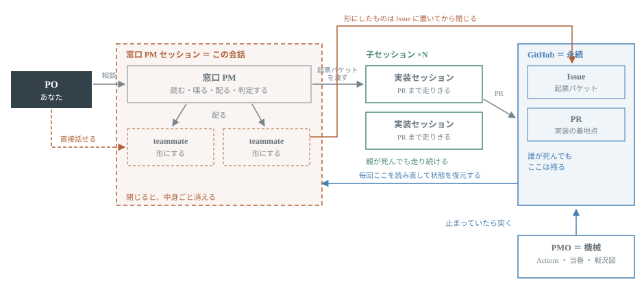

# 0050. 担い手の役割は、能力ではなく寿命で決める (窓口 PM はファイルを書かない / teammate は Issue に落として死ぬ / PMO は機械)

- Status: Proposed
- Date: 2026-08-12
- Deciders: PO (yomote) / 窓口 PM セッション
- Related: [ADR 0021](0021-parent-session-as-pm-orchestrator.md) (hub-and-spoke — 本 ADR はその復元と条件の書き直し) / [ADR 0033](0033-parent-implements-via-subagent-when-child-sessions-are-gated.md) (子セッションが起動できない環境での暫定 — 本 ADR が上書きする適用条件を持つ) / [ADR 0028](0028-dispatch-packet-in-issue-and-session-start-preflight.md) (起票パケット — 本 ADR の境目そのもの) / [ADR 0031](0031-agent-reaches-outside-via-github-actions.md) (外に触るのは Actions 経由) / [ADR 0040](0040-project-continuity-three-layers.md) (継続性 3 層) / ADR 0043 (**`main` に未収録** — PR [#284](https://github.com/yomote/mind-inbox/pull/284) / PMO の実体)

Technical Story: [Issue #348](https://github.com/yomote/mind-inbox/issues/348) — 2026-08-12 の対話セッションで PO と合意した内容の一次記録。本 ADR はその合意を判断記録の形に落としたもので、新しい決定を足していない。

## Context and Problem Statement

PO の指摘: **「PM セッションが作業に集中しすぎていて、いつ聞いても答えられる状態になっていない」**。

**原因は規律ではなく構造にある。** [ADR 0021](0021-parent-session-as-pm-orchestrator.md) は「窓口 PM は配る人・作業は子セッション」という設計だった。ところが [ADR 0033](0033-parent-implements-via-subagent-when-child-sessions-are-gated.md) (2026-08-10) で `create_session` が承認ゲートで弾かれると判明し、「小さい作業は親が直接書く」に切り替えた。**この時点で窓口が実装者になり、hub-and-spoke が反転した。** 窓口は常に何かを書いている状態になり、PO が話しかけたときに手が空いていない。

PO の言葉:

> サブエージェントを使ったところで、サブエージェントの管理をしているから (結局忙しい)
>
> 今何が起きているのか私に分からない。一元管理されていない

subagent への分配は窓口を痩せさせない。結果が窓口のコンテキストに返ってくるため、**窓口は「管理する人」ではなく「管理し続ける人」になる**。そして PO 側からは、複数の作業が同時に走っていることは分かっても、それがどこにあるのかが見えない。

決めるべきは「誰が何をやるか」であり、**その分け方の軸**である。

## Decision Drivers

- **窓口 PM が常に手を空けていること** — PO がいつ話しかけても、現在地を答えられる状態が守られること (これが今壊れている)
- **PO が「今何が動いているか」を一元的に見られること** — 窓口の口頭報告ではなく、PO 自身が見られる面があること
- **セッションが死んでも仕事が消えないこと** — この実行環境ではセッションもコンテナも使い捨て。「頭の中にある」は必ず失われる
- **PO にクリックを肩代わりさせないこと** ([ADR 0033](0033-parent-implements-via-subagent-when-child-sessions-are-gated.md) の driver を継承)
- **判断の主体をセッションに紐付けないこと** — 止まっているものを突く役目は、セッションが死んでいる間こそ働く必要がある

## Considered Options

- Option A: 現状維持 — 窓口 PM が subagent を使って実装まで抱える ([ADR 0033](0033-parent-implements-via-subagent-when-child-sessions-are-gated.md) の運用)
- Option B: 規律で直す — 「窓口は実装しないこと」と CLAUDE.md に書く
- Option C: **寿命で役割を分ける** — 担い手を「窓口と一緒に死ぬ / 独立して生きる / 永続する」の三段に分け、境目を機械的な条件で決める (採用)
- Option D: PM の下に **PMO エージェント**を立てる (PO の当初案)

## Decision Outcome

Chosen option: **"Option C"**。能力 (何ができるか) で分けると「できるから窓口がやる」に必ず流れて今の反転が再発する。**寿命で分ければ、置いていける場所が決まり、置き場所から役割が決まる。**

図の要点は 3 つ。**内側の点線 (窓口 PM セッション) の中身は、窓口を閉じた瞬間にまとめて消える** — teammate はその中にいる。**子セッションは外にいて、親が死んでも PR まで走りきる。** そして**どの担い手の矢印も最後は GitHub に向かう** — teammate は Issue に、子セッションは PR に。窓口は誰からの報告も受け取らず、毎回 GitHub を読み直して現在地を組み立て直す (右から左へ戻る矢印)。この 1 本があるおかげで、窓口が代替わりしても続きから読める。

### D1 — 寿命は三段。全員の納品物が GitHub に落ちる

|                              | 役割                                             | 生存期間                        | 成果物の行き先               |
| ---------------------------- | ------------------------------------------------ | ------------------------------- | ---------------------------- |
| **窓口 PM** (対話セッション) | 読む・喋る・配る・判定する                       | PO との対話の間                 | GitHub (判断の記録)          |
| **teammate**                 | 定義が固まっていない仕事を、対話しながら形にする | **lead (窓口 PM) と一緒に死ぬ** | **Issue (起票パケット)**     |
| **子セッション**             | 定義が固まった仕事を、PR がマージされるまで完走  | 独立 (親が死んでも生きる)       | **PR**                       |
| **PMO**                      | 止まっているものを見つけて突く                   | 永続 (機械 — D5)                | ダイジェスト / 通知 / 戦況図 |
| **GitHub**                   | 唯一の真実                                       | 永続                            | —                            |

**原則: どの担い手も、成果物を GitHub に落としてから消える。** 寿命が違うものを同じ器 (窓口のコンテキスト) に載せないことが、この分け方の目的である。

**subagent はこの表に載らない** — 窓口が自分の頭の延長として使う道具であり、結果が窓口のコンテキストに返ってくるため「窓口を痩せさせる」条件を満たさない。teammate が実際に使えると確認できたら (下の「動作検証」1)、[ADR 0033](0033-parent-implements-via-subagent-when-child-sessions-are-gated.md) が subagent に負わせていた役目は teammate へ移す。

### D2 — 窓口 PM はファイルを書かない

窓口の仕事は **読む・喋る・配る・判定する** の 4 つに閉じる。実装も調査も文書作成もしない。

- **これは [ADR 0033](0033-parent-implements-via-subagent-when-child-sessions-are-gated.md) の「レビュー指摘への対応・1〜2 ファイルの修正・設定調整は親が直接書く」を撤回する**。0033 の判断は「子セッションを起動できない」という制約から出たもので、制約自体は今も生きている (下の実測)。撤回するのはその帰結の方 — **窓口が書き手になった代償 (PO の窓口が塞がる) が、分配の手間より大きいと実測で分かった**ため
- 例外を置かない。「1 行だから」で書き始めると、窓口が塞がる構造がそのまま戻る
- 窓口が持つのは**判断の記録** (Issue / PR コメント / 裁定) だけ

### D3 — teammate と子セッションの境目は「起票パケットが書けるか」

**対象 Issue / 完遂条件 / 触ってはいけないファイル境界** ([ADR 0028](0028-dispatch-packet-in-issue-and-session-start-preflight.md) の起票パケット) の 3 つが書けたら、子セッションへ渡す。書けないなら、まだ teammate の段階 (= 何をやるかが決まっていない)。

- **大きさではなく定義の成熟度で分ける。** 「小さいから自分で書く」も「大きいから出す」も採らない
- 3 つが書けない仕事を渡すと、受け取った側は何を完遂すればよいか分からないまま走る。**渡せない = まだ形になっていない**、というだけのこと
- 形にする作業そのもの (調査・下書き・選択肢の洗い出し) は teammate の仕事であり、**窓口はそこにも入らない** (D2)

### D4 — teammate の納品物は「窓口への報告」ではなく Issue

teammate の頭の中にしかない状態で窓口を閉じると、**中身ごと消える** (D1 の寿命)。したがって:

- **形にしたものは必ず Issue に落としてから窓口を閉じる**。落ちていないものは「無かった」と同じ
- teammate から窓口への口頭報告を成果とみなさない。報告は窓口が読むための補助であって、納品物ではない
- これで teammate も子セッションも、置いていく先が GitHub に揃う (teammate → Issue / 子セッション → PR)。**窓口は誰からの報告にも依存せず、GitHub のライブ状態だけから現在地を組み立てられる**

### D5 — PMO はエージェントにせず、機械にする

PO の当初案は「PM と PMO を立てて、その下に開発者セッション」だった。**PMO をエージェントにするのは採らない** (PM 側の判断)。

- **理由: PMO はセッションが死んでいる間こそ働く必要がある。** セッションと運命を共にする主体は、この役目に向かない。窓口が閉じている夜間・PO が寝ている間に「止まっているもの」を見つけるのが PMO の存在意義であり、そこに寿命のある担い手を置くと、いちばん必要なときに居ない
- **PMO の実体**: `review-gate` の 30 分毎 sweep ([ADR 0040](0040-project-continuity-three-layers.md) D1) / 毎日 18:00 の当番 Routine / ADR 0043 の日次ダイジェストと窓口台帳 (PR [#284](https://github.com/yomote/mind-inbox/pull/284)) / [#289](https://github.com/yomote/mind-inbox/issues/289) の戦況図
- **つまり PMO は既に設計済みで、PR [#284](https://github.com/yomote/mind-inbox/pull/284) がそれである。未マージなだけ。** 新しく作るものは無く、着地させることが PMO の実体化にあたる
- したがって **PR [#284](https://github.com/yomote/mind-inbox/pull/284) と [#289](https://github.com/yomote/mind-inbox/issues/289) を他の実装より先に置く** — 増えた並行作業を PO が追えない状態を先に解消するため

### D6 — 当面の WIP (同時に配る作業) は 1 本

ADR 0043 (PR [#284](https://github.com/yomote/mind-inbox/pull/284)) の WIP 上限は 2 だが、2026-08-12 時点の混乱度から**当面 1 本**に落とす (PM 判断)。

- 数えるのは「同時に配る作業」。**PR の見届けは窓口の仕事なので数えない**
- 戻すのは、PO が戦況図で並行作業を追える状態になってから ([#289](https://github.com/yomote/mind-inbox/issues/289) の着地後)

## 実測 (2026-08-12)

本 ADR の前提になっている環境の事実。[Issue #348](https://github.com/yomote/mind-inbox/issues/348) に一次記録がある。

| 確かめたこと                                            | 結果                                                                                                                                                                                                                  |
| ------------------------------------------------------- | --------------------------------------------------------------------------------------------------------------------------------------------------------------------------------------------------------------------- |
| `create_session` / `list_environments`                  | **承認ゲートで弾かれる** (読み取り専用の一覧取得すら)。[ADR 0033](0033-parent-implements-via-subagent-when-child-sessions-are-gated.md) の前提は今も生きている                                                        |
| `.claude/settings.json` の permissions に恒久許可を追加 | **同一セッション内では解除されず**。反映にセッション再起動が要る可能性 (次セッションで再実測)                                                                                                                         |
| Agent Teams (teammates) の実在                          | **実在する**。`CLAUDE_CODE_EXPERIMENTAL_AGENT_TEAMS=1` で有効化 ([公式ドキュメント](https://code.claude.com/docs/en/agent-teams))。設定に追加済み                                                                     |
| この環境で teammate が使えるか                          | フラグは有効化済み・配管も存在 (`SendMessage` の宛先に "Teammate by name"、`TaskStop` が `name@team` を受理、`TaskList` に teammate 用手順)。**ただし起動口が当該セッションのツール面に現れず**、次セッションで再確認 |
| tmux                                                    | **インストール済み (3.4)**。ただし `TMUX=none` (未使用)。**入れても意味が無い** — コンテナ自体が使い捨てなので死ぬ層が 1 つ外側に移るだけ。かつ web からペインは見えない                                              |

## Consequences

### Positive Consequences

- **窓口が常に手を空けている** — PO がいつ話しかけても、GitHub のライブ状態から現在地を答えられる (これが今回の目的そのもの)
- **置き場所が寿命から一意に決まる** — 「どこに残すか」を毎回考えなくてよい。teammate は Issue、子セッションは PR
- **窓口の代替わりが安くなる** — 引き継ぎは GitHub にあり、口頭の申し送りに依存しない ([ADR 0040](0040-project-continuity-three-layers.md) の継続性を、担い手の側から支える)
- **PMO を新規に作らなくてよい** — 既に設計済み (PR [#284](https://github.com/yomote/mind-inbox/pull/284)) と分かったので、決定の帰結は「着地させる」だけ
- **hub-and-spoke が [ADR 0021](0021-parent-session-as-pm-orchestrator.md) の形に戻る** — 反転していた構造を、制約を認めたまま元に戻せる

### Negative Consequences

- **teammate は窓口と一緒に死ぬので、PR の完走には使えない** — レビュー往復のように「セッションをまたぐ」仕事は teammate に出せない。そこは子セッション (または `create_session` が通るまでは subagent) が担う
- **teammate の権限プロンプトは lead (窓口) に出るため、承認の負荷は窓口に残る** — 「窓口が常に手を空けている」は完全には達成されない。手が空くのは書く仕事からであって、承認からではない
- **teammate ごとに独立コンテキストなので token 消費が線形に増える** — 窓口を痩せさせる代償。1 本の太いコンテキストを、複数の細いコンテキストに置き換えている
- **窓口が結果を読んで判定する負荷は消えない** — 配れば配るほど、返ってきたものを読む仕事は増える。緩和策は 2 つ: **完遂条件を指示文に厚く書く** (読む量ではなく判定の一意性で解く) / **深い検証は Codex のレビューと `review-gate` に任せる** ([ADR 0035](0035-role-split-across-agents-and-actions.md) / [ADR 0036](0036-merge-gate-as-required-check-and-pm-cadence.md) — 窓口は色を読む)
- **D2 が [ADR 0033](0033-parent-implements-via-subagent-when-child-sessions-are-gated.md) を撤回するのに、その原因 (`create_session` が弾かれる) は解消していない** — teammate が立たず恒久許可も効かなければ、実装の担い手は subagent のままになる。そのとき D2 は「窓口は subagent に出す」の意味に縮む

## 未解決の穴 — 「配ったのに何も出てこなかった子」を検知できない

**巡回も当番も、見ているのは GitHub 側の PR / Issue だけである。** 子セッションが権限確認待ちで止まる・途中で詰まる等で**何も生まずに終わった場合、誰も気づかない**。配った記録は窓口のコンテキストにあり、窓口が閉じれば消える。

PR [#284](https://github.com/yomote/mind-inbox/pull/284) の着地時に、**「配った記録」と「出てきたもの」を突き合わせる**項目を PMO に足す (窓口台帳が配った記録の置き場になる)。それまでは、この穴が開いていることを承知のうえで運用する。

## 動作検証 (この ADR が実装されたと言える条件)

次のセッションで、この順に確かめる。

1. **teammate が実際に立つか** — 立たなければ「子セッション一本」に倒す (teammate 前提の D3 / D4 は、子セッションへの分配基準として読み替える)
2. **共有タスクリストが PO の画面に見えるか** — ⭐ **これが最重要**。見えるなら「今何が動いているか分からない」が解消する。**見えないなら teammate の価値はほぼ無く、採用しない** (subagent との差が「文脈が分かれる」だけになる)
3. **`create_session` の恒久許可が効くようになっているか** — 効けば実装者を子セッションに出せる (D1 の三段がそのまま成立する)
4. **窓口の文脈が本当に太らないか** — teammate に仕事を渡したときの実測。太るなら D1 の前提 (「窓口を痩せさせる」) が成り立っていない

## Pros and Cons of the Options

### Option A: 現状維持 (窓口が subagent で実装まで抱える)

- Good, because 追加の仕組みが要らない。`create_session` が弾かれる制約とも矛盾しない
- Bad, because **PO の窓口が塞がる** — 今回の指摘そのもの。「サブエージェントを使ったところで、サブエージェントの管理をしている」
- Bad, because 窓口のコンテキストが太り、代替わりのたびに読み直しが重くなる

### Option B: 規律で直す (「窓口は実装しない」と書く)

- Good, because 今日から書ける。コストがゼロ
- Bad, because **規律は破られる** — このリポジトリの一貫した実績 ([ADR 0036](0036-merge-gate-as-required-check-and-pm-cadence.md) / [ADR 0028](0028-dispatch-packet-in-issue-and-session-start-preflight.md))。「1 行だから」で必ず戻る
- Bad, because 「じゃあ誰が書くのか」に答えていない。行き先を決めずに禁止だけしても、仕事は消えない

### Option C: 寿命で役割を分ける (採用)

- Good, because 境目が**機械的に判定できる** — 起票パケットの 3 項目が書けるかどうか (D3)。人の裁量が入らない
- Good, because 「どこに残すか」が寿命から一意に決まるので、**消える仕事が構造的に減る** (D4)
- Good, because PMO を機械に固定したことで、**セッションが全部死んでいる時間帯**にも見張りが残る (D5)
- Bad, because teammate が実在して使えることが前提 — 立たなければ三段のうち 1 段が空く (動作検証 1 / 2)
- Bad, because 承認の負荷と判定の負荷は窓口に残る (Negative)

### Option D: PMO エージェントを立てる

- Good, because 窓口 PM の負荷を、判断ごと分担できる
- Bad, because **PMO はセッションが死んでいる間こそ働く必要がある** — エージェントにすると、いちばん必要なときに居ない
- Bad, because 見張りが増えるほど「見張りを見張る人」が要る。機械なら Actions の実行履歴が生死の証跡になる ([ADR 0035](0035-role-split-across-agents-and-actions.md) 「生死が見える場所に置く」)
- Bad, because 既に PR [#284](https://github.com/yomote/mind-inbox/pull/284) が同じ役目を機械として設計済みで、二重になる

## Links

- 一次記録: [Issue #348](https://github.com/yomote/mind-inbox/issues/348) — 2026-08-12 の合意 (本 ADR の素材)
- 関連 ADR: [0021](0021-parent-session-as-pm-orchestrator.md) (hub-and-spoke) / [0033](0033-parent-implements-via-subagent-when-child-sessions-are-gated.md) (親が実装する暫定 — D2 が撤回) / [0028](0028-dispatch-packet-in-issue-and-session-start-preflight.md) (起票パケット) / [0031](0031-agent-reaches-outside-via-github-actions.md) (外に触るのは Actions 経由) / [0040](0040-project-continuity-three-layers.md) (継続性 3 層)
- ADR 0043 (**`main` に未収録** — PR [#284](https://github.com/yomote/mind-inbox/pull/284)): PM 自走モード = PMO の実体 (日次ダイジェスト / 窓口台帳 / WIP 上限)
- [#289](https://github.com/yomote/mind-inbox/issues/289): 戦況図の描画 (PO が状態を見る画面)
- 図: [`assets/0050-roles-and-lifetimes.svg`](assets/0050-roles-and-lifetimes.svg)
