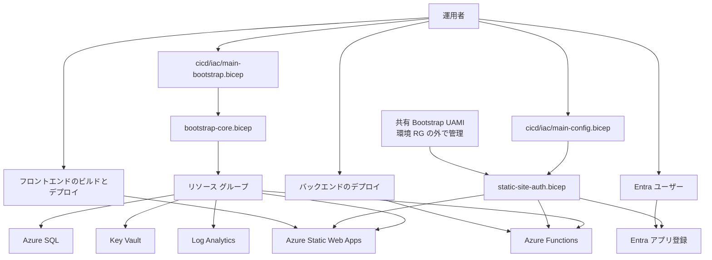
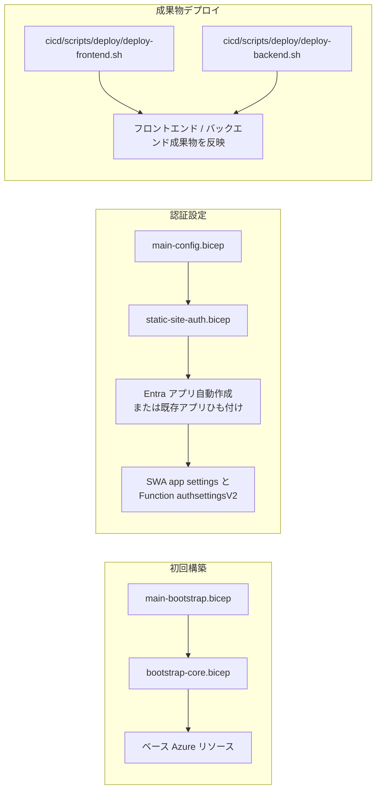
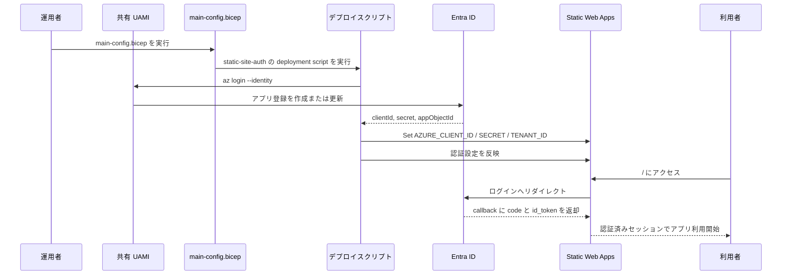
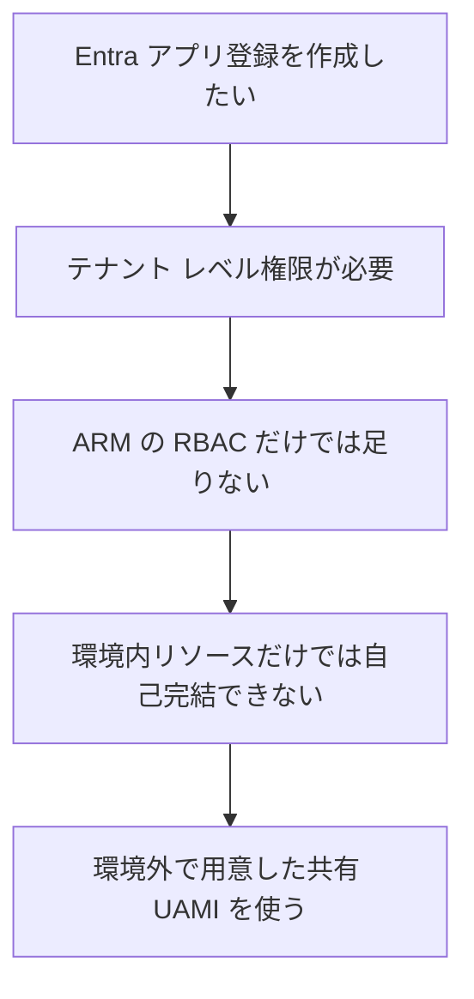
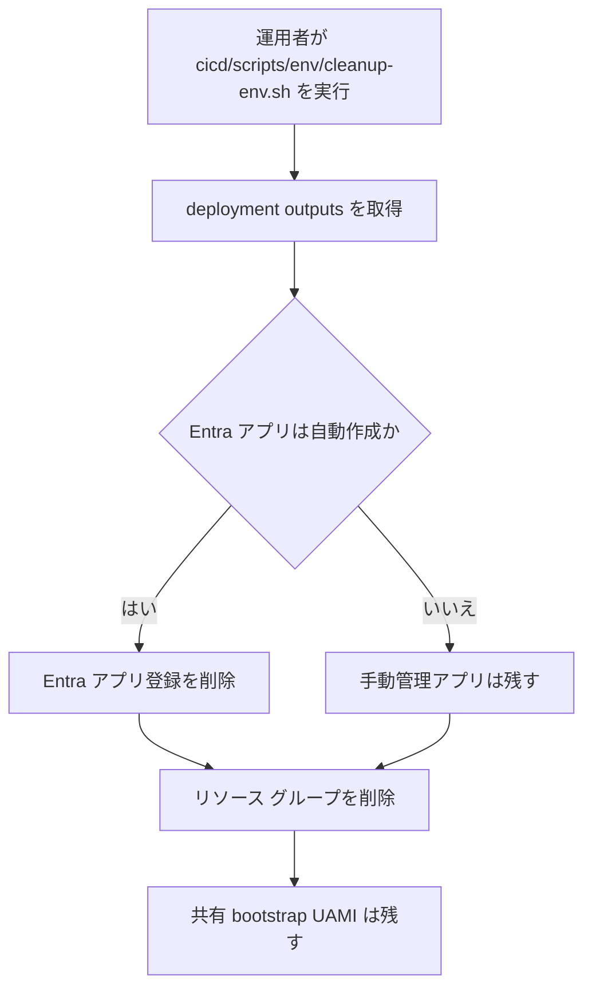

# インフラ / デプロイ概要

このプロジェクトは、Azure リソース作成、認証設定、成果物デプロイ、削除が別レイヤーに分かれています。
混線しやすいので、流れを Mermaid で整理します。

## 1. 全体像

## 2. 構築と更新の責務分離

## 3. Entra 認証の流れ

## 4. UAMI が必要な理由

## 5. 削除の流れ

## 6. 実運用メモ

- `main-bootstrap.bicep` は Azure リソース作成を担当
- `main-config.bicep` は Entra 認証設定を担当
- frontend/backend の成果物反映は別スクリプトで行う
- Entra アプリ自動作成を使うなら、事前に共有 UAMI を準備する
- 環境削除では、自動作成した Entra アプリ登録だけを消し、共有 UAMI は残す
