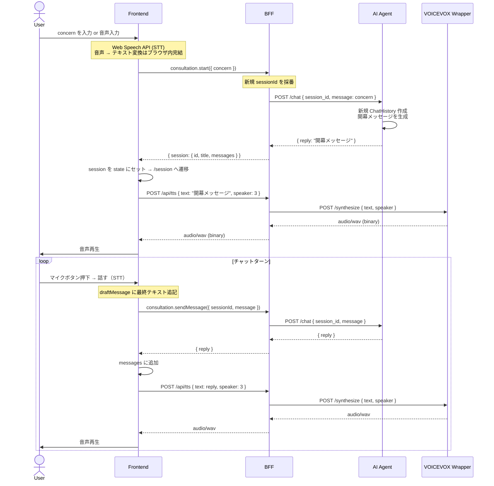
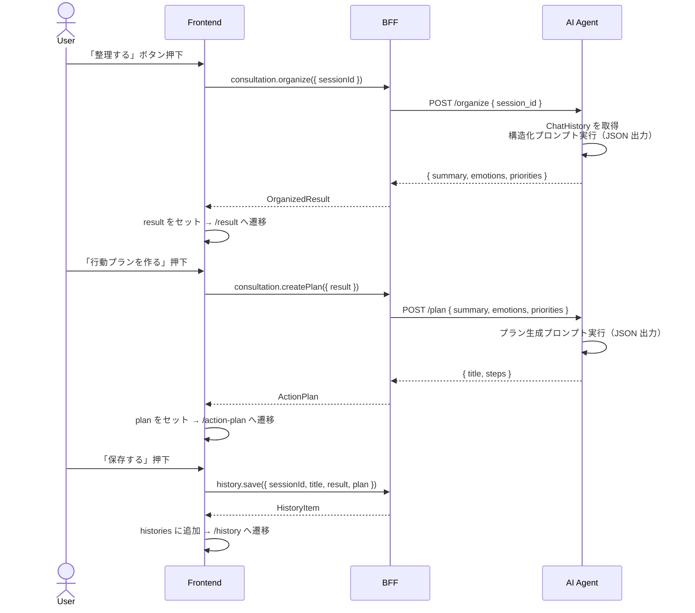
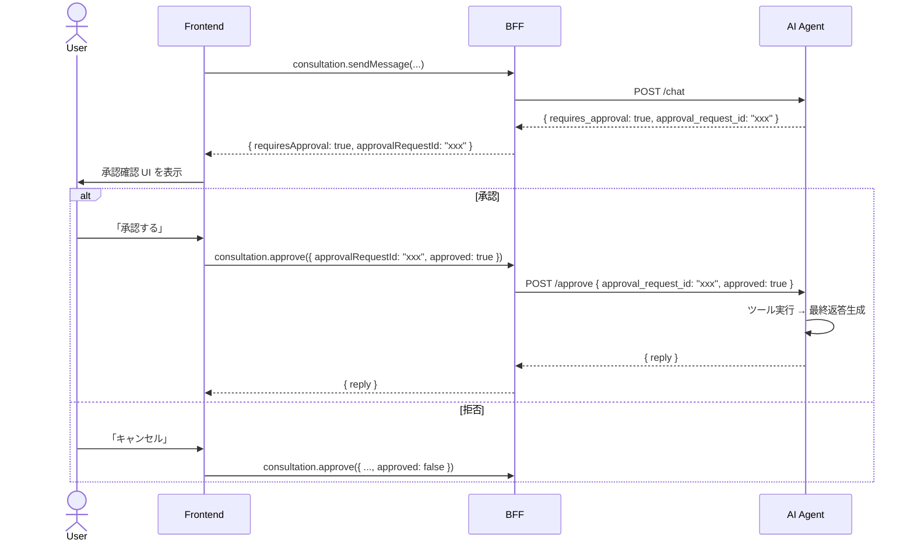

# Mind Inbox — 基本設計書（PoC フェーズ）

作成: 2026-05-01 / 対象フェーズ: PoC（最低限の一気通貫疎通）

---

## 1. 設計方針

### 1.1 PoC ゴール

「モヤモヤを話す → AI が構造化する → 自己理解の地図として育つ」という
3 ステップを、実 AI バックエンドと接続した状態で一気通貫に動作させる。

**疎通させる 4 ユーザーフロー**

1. **音声入力（STT）** — マイクで話す → テキスト変換 → AI へ送信
2. **チャット** — 悩みを入力 → AI と複数ターン対話 → 音声で返答（TTS）
3. **整理** — セッション終了 → AI が感情・優先事項を構造化（`OrganizedResult`）
4. **プラン** — 整理結果 → AI が行動プランを生成（`ActionPlan`）

### 1.2 設計原則

| 原則 | 意図 |
| --- | --- |
| **インタフェースは本番同等、実装は最小** | 後から差し替えやすい骨格を固める |
| **フロントエンドは BFF だけを知る** | サービストポロジーの変更をフロントに波及させない |
| **スタブはインタフェースを満たす** | Repository パターン・stub fallback で差し替えコストを最小化 |
| **型安全を end-to-end で確保** | tRPC の型共有を PoC から確立する |
| **PoC 制約は明示** | TODO コメント・本設計書で管理し、暗黙の技術的負債を残さない |

### 1.3 PoC スコープ

| 機能 | PoC | 判断理由 |
| --- | :---: | --- |
| Frontend → BFF tRPC 実接続 | ✅ | 最重要ギャップの解消 |
| セッション開始・チャット | ✅ | コアフロー |
| 整理・アクションプラン生成 | ✅ | コアフロー |
| 音声入力 STT（Web Speech API） | ✅ | 実装済み、設計に明示する |
| 音声出力 TTS（BFF → VOICEVOX Wrapper） | ✅ | BFF 経由で疎結合を確保する |
| セッション永続化（DB） | ❌ | in-memory + Repository I/F のみ定義 |
| 履歴永続化 | ❌ | in-memory のみ |
| RAG（Azure AI Search） | ❌ | スタブ継続 |
| 副作用ツール実行（承認フロー） | ❌ | FSM 骨格は維持するが実ツールは未実装 |

---

## 2. ターゲットアーキテクチャ（PoC）

```mermaid
graph LR
  subgraph Browser["🌐 Browser"]
    subgraph FE["Frontend · React + Vite + MUI"]
      Layout["Layout.tsx<br/>状態管理 / Auth / ハンドラ"]
      TrpcClient["trpc/client.ts<br/>tRPC HTTP Client"]
      ApiLayer["api/<br/>consultation.ts · history.ts"]
    end
    STT["Web Speech API<br/>(STT · ブラウザネイティブ)"]
  end

  subgraph Azure["☁️ Azure"]
    AuthEndpoint["SWA · /.auth/me<br/>(Entra ID)"]

    subgraph BFF["BFF · Azure Functions v4"]
      TrpcFn["trpc.ts<br/>POST GET /api/trpc/{path}"]
      BFFRouter["router.ts<br/>consultation.* / history.* / health.*"]
      AIClientTS["aiAgentClient.ts<br/>(stub fallback)"]
      TtsFn["tts.ts<br/>POST /api/tts  ← 新規"]
      VoiceClientTS["voicevoxClient.ts<br/>(stub fallback)"]
    end

    subgraph AIAgentSvc["AI Agent · FastAPI · :8000"]
      AIMain["main.py<br/>/chat /organize /plan /approve"]
      Workflow["workflow.py<br/>WorkflowState FSM"]
      Organizer["organizer.py<br/>構造化プロンプト"]
      Planner["planner.py<br/>プラン生成プロンプト"]
      Repos["repositories.py<br/>⚠️ in-memory (PoC)"]
      SK["Semantic Kernel"]
    end

    subgraph VVWrap["VOICEVOX Wrapper · FastAPI · :8001"]
      VVMain["main.py<br/>POST /synthesize"]
      VVClientPy["voicevox_client.py"]
    end

    AzureOAI["Azure OpenAI<br/>GPT-4o"]
  end

  VVEngine["🐳 VOICEVOX Engine<br/>:50021"]

  Layout --> TrpcClient
  TrpcClient --> ApiLayer
  Layout --> ApiLayer
  Layout <--> STT

  Layout -- "GET /.auth/me" --> AuthEndpoint

  ApiLayer -- "tRPC over HTTP" --> TrpcFn
  TrpcFn --> BFFRouter
  BFFRouter --> AIClientTS

  Layout -- "POST /api/tts<br/>{ text, speaker }<br/>← 同一オリジン" --> TtsFn
  TtsFn --> VoiceClientTS
  VoiceClientTS -- "POST /synthesize<br/>→ audio/wav (binary)" --> VVMain

  AIClientTS -- "POST /chat<br/>POST /organize<br/>POST /plan" --> AIMain

  AIMain --> Workflow
  AIMain --> Organizer
  AIMain --> Planner
  Workflow --> Repos
  Organizer --> Repos
  Organizer --> SK
  Planner --> SK
  Workflow --> SK

  SK -- "AzureChatCompletion" --> AzureOAI

  VVMain --> VVClientPy
  VVClientPy -- "POST /audio_query<br/>POST /synthesis" --> VVEngine
```



フロントエンドは `/api/trpc/*` と `/api/tts` の 2 エンドポイントだけを知る。
VOICEVOX Wrapper の URL はBFF の環境変数にのみ存在する。

### 2.1 コンポーネント役割まとめ

| コンポーネント | 役割 | PoC での変更 |
| --- | --- | --- |
| `Layout.tsx` | 全ステートの管理・ハンドラ定義 | mockApi → `api/` レイヤー切り替え、TTS を `/api/tts` に変更 |
| `api/` (新規) | BFF 呼び出しの抽象化。mock/real を env で切り替え | 新規作成 |
| `trpc/client.ts` (新規) | tRPC HTTP クライアントの初期化 | 新規作成 |
| BFF `trpc.ts` | tRPC の Azure Function エントリポイント | 変更なし |
| BFF `router.ts` | tRPC ルーター。consultation / history を追加 | 拡張 |
| BFF `tts.ts` (新規) | TTS プロキシの Azure Function。`/api/tts` | **新規作成** |
| `aiAgentClient.ts` | AI Agent への HTTP クライアント | organize / plan メソッドを追加 |
| `voicevoxClient.ts` | Wrapper への HTTP クライアント | `{ audioUrl }` → `ArrayBuffer` に修正 |
| AI Agent `main.py` | FastAPI エントリポイント | `/organize` `/plan` を追加 |
| `organizer.py` (新規) | セッション履歴 → OrganizedResult | 新規作成 |
| `planner.py` (新規) | OrganizedResult → ActionPlan | 新規作成 |
| `repositories.py` (新規) | Session / History Repository I/F + in-memory | 新規作成 |
| `workflow.py` | チャット FSM 制御 | システムプロンプト改修のみ |

---

## 3. API 設計

### 3.1 BFF — tRPC ルーター構成

`apps/bff/src/trpc/router.ts` を以下の構成に拡張する。

```text
appRouter
├── health
│   └── ping                    query     既存
├── consultation
│   ├── start                   mutation  新規
│   ├── sendMessage             mutation  既存 chat.sendMessage を移設
│   ├── organize                mutation  新規
│   ├── createPlan              mutation  新規
│   └── approve                 mutation  新規
└── history
    ├── list                    query     新規
    └── save                    mutation  新規
```

#### `consultation.start`

```typescript
// Input
z.object({ concern: z.string().min(1) })

// Output
{
  session: {
    id: string;
    title: string;
    messages: ChatMessage[];  // [user: concern, assistant: 開幕返答]
  }
}
```

BFF が新規 `sessionId`（UUID）を採番し、AI Agent `POST /chat` を呼び出して
開幕メッセージを取得。ConsultationSession を構築して返す。

#### `consultation.sendMessage`

```typescript
// Input
z.object({
  sessionId: z.string().min(1),
  message: z.string().min(1),
})
// withAudio は廃止。TTS は /api/tts で独立して処理する。

// Output
{
  reply: string;
  requiresApproval: boolean;
  approvalRequestId: string | null;
  citations: string[];
}
```

#### `consultation.organize`

```typescript
// Input
z.object({ sessionId: z.string().min(1) })

// Output
{ summary: string; emotions: string[]; priorities: string[] }
```

#### `consultation.createPlan`

```typescript
// Input
z.object({
  result: z.object({
    summary: z.string(),
    emotions: z.array(z.string()),
    priorities: z.array(z.string()),
  }),
})

// Output
{ title: string; steps: string[] }
```

sessionId 不要。OrganizedResult のみで完結する。

#### `consultation.approve`

```typescript
// Input
z.object({ approvalRequestId: z.string(), approved: z.boolean() })

// Output
{ reply: string }
```

#### `history.list`

```typescript
// Output
HistoryItem[]
// TODO(PoC): in-memory のため再起動で消える
```

#### `history.save`

```typescript
// Input
z.object({
  sessionId: z.string(),
  title: z.string(),
  result: OrganizedResultSchema,
  plan: ActionPlanSchema,
})

// Output
HistoryItem
```

---

### 3.2 BFF — `POST /api/tts`（非 tRPC Azure Function）

tRPC は JSON シリアライズを前提とするため、バイナリ音声データは
専用の Azure Function HTTP trigger として実装する。

```typescript
// apps/bff/src/functions/tts.ts

app.http("tts", {
  methods: ["POST"],
  authLevel: "anonymous",
  route: "tts",
  handler: async (req, context) => {
    const { text, speaker } = await req.json() as TtsRequest;

    const audio = await synthesize({ text, speakerId: speaker ?? 3 });

    if (!audio) {
      // VOICEVOX_BASE_URL 未設定時の stub: 無音を返す
      return { status: 204 };
    }

    return {
      status: 200,
      headers: { "Content-Type": "audio/wav" },
      body: Buffer.from(audio),
    };
  },
});
```

**リクエスト（JSON）:**

```json
{ "text": "こんにちは", "speaker": 3 }
```

**レスポンス:**

- `200 audio/wav` — 音声バイナリ
- `204 No Content` — VOICEVOX 未設定の stub 時（フロントはスキップ）

---

### 3.3 BFF — `voicevoxClient.ts` の修正

現在の `SynthesizeResponse = { audioUrl: string }` を廃止し、
`ArrayBuffer | null` を返すように変更する。

```typescript
// Before
export async function synthesize(req): Promise<SynthesizeResponse>
// → { audioUrl: "stub://audio/not-available" }

// After
export async function synthesize(req): Promise<ArrayBuffer | null>
// → ArrayBuffer (音声バイナリ) | null (stub 時)
```

stub 時は `null` を返し、呼び出し元（`tts.ts`）が `204` として処理する。

---

### 3.4 AI Agent — FastAPI エンドポイント

| Method | Path | 用途 | 状態 |
| --- | --- | --- | --- |
| `POST` | `/chat` | 会話ターン | 既存（プロンプト改修） |
| `POST` | `/organize` | セッション → OrganizedResult | **新規** |
| `POST` | `/plan` | OrganizedResult → ActionPlan | **新規** |
| `POST` | `/approve` | ツール実行承認 | 既存 |
| `GET` | `/health` | ヘルスチェック | 既存 |

#### `POST /organize` スキーマ

```python
class OrganizeRequest(BaseModel):
    session_id: str

class OrganizeResponse(BaseModel):
    summary: str
    emotions: list[str]
    priorities: list[str]
```

#### `POST /plan` スキーマ

```python
class PlanRequest(BaseModel):
    summary: str
    emotions: list[str]
    priorities: list[str]

class PlanResponse(BaseModel):
    title: str
    steps: list[str]
```

---

## 4. データモデル

```typescript
type ChatRole = "user" | "assistant";

type ChatMessage = {
  id: string;
  role: ChatRole;
  text: string;
  createdAt: string;  // ISO 8601
};

type ConsultationSession = {
  id: string;
  title: string;
  messages: ChatMessage[];
};

type OrganizedResult = {
  summary: string;
  emotions: string[];
  priorities: string[];
};

type ActionPlan = {
  title: string;
  steps: string[];
};

type HistoryItem = {
  id: string;
  title: string;
  createdAt: string;
  result: OrganizedResult;
  plan: ActionPlan;
};
```

> **セッション状態の二重管理**:
> `ConsultationSession.messages` はフロントエンドの表示ステートとして保持する。
> AI Agent は同じ会話を `ChatHistory`（Semantic Kernel）として独立保持する。
> 両者は `sessionId` で対応付けられる。

---

## 5. シーケンス図

### 5.1 セッション開始・チャット（音声入力あり）



### 5.2 整理 → アクションプラン生成



### 5.3 承認フロー（将来の副作用ツール用）



---

## 6. 音声対話設計

### 6.1 音声入力（STT）

| 項目 | 内容 |
| --- | --- |
| 実装方式 | Web Speech API（`SpeechRecognition` / `webkitSpeechRecognition`） |
| サーバー不要 | ブラウザ内完結。外部 API への通信なし |
| モード | `continuous: true`, `interimResults: true` |
| 言語 | `ja-JP` |
| 結果の扱い | 確定テキストを `draftMessage` に追記、中間テキストを別途表示 |
| フォールバック | `sttSupported: false` の場合はマイクボタンを非表示 |

STT はすでに動作実装済み。PoC での追加実装なし。

### 6.2 音声出力（TTS）経路設計

フロントエンドは BFF `/api/tts` に JSON を POST し、`audio/wav` バイナリを受け取る。
VOICEVOX Wrapper の URL はフロントエンドが知る必要がない。

```text
Frontend
  └─ POST /api/tts { text, speaker }
        └─ BFF tts.ts
              └─ voicevoxClient.ts
                    └─ POST /synthesize → VOICEVOX Wrapper
                                └─ POST /audio_query
                                   POST /synthesis → VOICEVOX Engine
```

**フォールバック構造:**

```text
BFF /api/tts 200 → audio/wav を再生
      ↓ 204 (stub) または fetch 失敗
Web SpeechSynthesis API (ja-JP) → ブラウザ TTS
      ↓ 非対応ブラウザ
無音・エラー表示
```

stub 時（`VOICEVOX_BASE_URL` 未設定）は BFF が `204 No Content` を返す。
フロントエンドは 204 を受け取ったら Web SpeechSynthesis へフォールバックする。

### 6.3 フロントエンドの変更点（`Layout.tsx`）

```typescript
// Before: Engine に 2 ステップ直接呼び出し
POST /audio_query?text=...&speaker=...   → audioQuery (JSON)
POST /synthesis?speaker=...             → audio/wav

// After: BFF 経由 1 ステップ
POST /api/tts { text, speaker }         → audio/wav (200) または 204
```

```typescript
// After の synthesizeWithVoicevox 実装例
const synthesizeWithVoicevox = useCallback(
  async (text: string): Promise<Blob> => {
    const res = await fetch('/api/tts', {
      method: 'POST',
      headers: { 'Content-Type': 'application/json' },
      body: JSON.stringify({ text, speaker: voicevoxSpeaker }),
    });
    if (res.status === 204) {
      throw new Error('TTS_STUB'); // フォールバックをトリガー
    }
    if (!res.ok) throw new Error('TTS synthesis failed');
    return res.blob();
  },
  [voicevoxSpeaker],
);
```

フロントエンドから削除できる変数・処理:

- `voicevoxBaseUrl` state（BFF 側の環境変数に移動）
- `VITE_VOICEVOX_BASE_URL` env var（フロントエンドでは不要）
- Engine 向け warm-up（`GET /version` チェックと初回合成キャッシュ）
  → start-voicevox.sh がエンジンレベルで warm-up 済み

残す設定:

- `VITE_VOICEVOX_SPEAKER`（話者 ID、デフォルト `3`）

### 6.4 ローカル開発セットアップ

```bash
# 1. VOICEVOX Engine（Docker）
cicd/scripts/local-voicevox/start-voicevox.sh
# → http://localhost:50021

# 2. VOICEVOX Wrapper
cd apps/services/voicevox
pip install -r requirements.txt
uvicorn app.main:app --reload --port 8001
# → http://localhost:8001

# 3. BFF の .env 設定（local.settings.json.example を参照）
# VOICEVOX_BASE_URL=http://localhost:8001  ← Wrapper を指す

# 4. フロントエンドの .env.local（話者 ID のみ）
# VITE_VOICEVOX_SPEAKER=3
```

---

## 7. AI Agent ワークフロー設計

### 7.1 操作種別の責務分離

| 操作 | エンドポイント | モジュール | 処理方式 |
| --- | --- | --- | --- |
| チャット | `POST /chat` | `workflow.py` | WorkflowState FSM |
| 整理 | `POST /organize` | `organizer.py` | 単発 structured LLM 呼び出し |
| プラン生成 | `POST /plan` | `planner.py` | 単発 structured LLM 呼び出し |

整理・プラン生成は FSM を経由しない。1 回の LLM 呼び出しで完結するため
専用モジュールで直接処理する。FSM は将来のツール実行・承認フローのために保持する。

### 7.2 システムプロンプト改修

現状の `workflow.py` は "inbox 管理用汎用 AI" 向けのプロンプト。以下に変更する。

```python
CHAT_SYSTEM_PROMPT = """\
あなたは「Mind Inbox」の対話 AI です。
ユーザーが頭の中のモヤモヤや悩みを言語化できるよう、
共感的かつ具体的な問いかけで対話を深めてください。

応答ルール:
- 返答は 3 文以内に収める
- 評価・アドバイスはせず、まず気持ちに寄り添う
- 具体的なエピソードや感情を引き出す問いかけを 1 つ含める
- ユーザーと同じ言語（原則日本語）で答える
"""
```

### 7.3 `organizer.py` 設計方針

```python
async def organize(
    session_id: str,
    session_repo: SessionRepository,
) -> OrganizeResponse:
    history = await session_repo.get(session_id)
    # 会話履歴を文字列に整形
    # response_format={"type": "json_object"} で以下の JSON を要求:
    # { "summary": str, "emotions": [str], "priorities": [str] }
```

プロンプト構造:

```text
以下の会話を分析し、JSON 形式で回答してください。

会話:
{conversation_text}

回答形式:
{
  "summary": "現在の状況の要約（2-3文）",
  "emotions": ["感情1", "感情2"],    // 3つ以内
  "priorities": ["優先事項1", ...]   // 3つ以内
}
```

### 7.4 `planner.py` 設計方針

```python
async def generate_plan(req: PlanRequest) -> PlanResponse:
    # OrganizedResult を元に行動プランを生成
    # response_format={"type": "json_object"} で以下を要求:
    # { "title": str, "steps": [str] }
```

---

## 8. 永続化設計

### 8.1 Repository パターン

PoC では in-memory 実装を提供し、インタフェースのみ本番同等で定義する。

```python
# apps/services/ai-agent/app/repositories.py

from typing import Protocol
from semantic_kernel.contents import ChatHistory

class SessionRepository(Protocol):
    async def get(self, session_id: str) -> ChatHistory | None: ...
    async def save(self, session_id: str, history: ChatHistory) -> None: ...
    async def delete(self, session_id: str) -> None: ...

class HistoryRepository(Protocol):
    async def list(self) -> list[HistoryRecord]: ...
    async def save(self, record: HistoryRecord) -> None: ...
    async def get(self, record_id: str) -> HistoryRecord | None: ...
```

### 8.2 PoC 実装（in-memory）

```python
class InMemorySessionRepository:
    """TODO(PoC): 再起動でセッションが消える。本番では Redis に差し替える。"""
    _store: dict[str, ChatHistory] = {}

class InMemoryHistoryRepository:
    """TODO(PoC): 再起動で履歴が消える。本番では Cosmos DB に差し替える。"""
    _store: list[HistoryRecord] = []
```

`workflow.py` のモジュールレベル `_sessions` / `_approvals` dict を
この Repository に移設する。

### 8.3 将来の差し替え候補

| 用途 | PoC | 本番候補 |
| --- | --- | --- |
| セッション履歴（短命） | in-memory | Azure Cache for Redis |
| 整理結果・行動プラン | in-memory | Azure Cosmos DB for NoSQL |
| ユーザー設定 | なし | Cosmos DB or Azure SQL |

---

## 9. フロントエンド統合方針

### 9.1 依存パッケージ追加

```bash
cd apps/frontend
npm install @trpc/client @trpc/react-query @tanstack/react-query
```

### 9.2 tRPC クライアント設定

```typescript
// apps/frontend/src/trpc/client.ts
import { createTRPCClient, httpBatchLink } from '@trpc/client';
import type { AppRouter } from '../../../bff/src/trpc/router';  // 型のみ

const getBaseUrl = () =>
  import.meta.env.DEV
    ? (import.meta.env.VITE_BFF_BASE_URL ?? 'http://localhost:7071')
    : '';

export const trpc = createTRPCClient<AppRouter>({
  links: [httpBatchLink({ url: `${getBaseUrl()}/api/trpc` })],
});
```

> **型共有**: PoC は `../../../bff/src/trpc/router` からの直接 `import type`
> とする（runtime import ではなく型のみのため BFF のビルドは不要）。
> 本番フェーズでは `packages/types` などの shared パッケージに切り出す。

### 9.3 Vite プロキシ設定

```typescript
// apps/frontend/vite.config.ts
server: {
  proxy: {
    '/api': {
      target: 'http://localhost:7071',  // Azure Functions Core Tools
      changeOrigin: true,
    },
  },
},
```

`/api/trpc/*` と `/api/tts` の両方がこのプロキシでカバーされる。

### 9.4 api/ 抽象レイヤーの新設

```text
apps/frontend/src/api/
├── consultation.ts   start / sendMessage / organize / createPlan / approve
└── history.ts        list / save
```

```typescript
// apps/frontend/src/api/consultation.ts
const useMock = import.meta.env.VITE_USE_MOCK === 'true';

export const startNewConsultation = useMock
  ? mock.startNewConsultation
  : async (concern: string) => {
      const { session } = await trpc.consultation.start.mutate({ concern });
      return session;
    };

export const sendMessage = useMock
  ? mock.sendMessage
  : async (sessionId: string, text: string) => {
      const res = await trpc.consultation.sendMessage.mutate({
        sessionId,
        message: text,
      });
      return {
        id: crypto.randomUUID(),
        role: 'assistant' as const,
        text: res.reply,
        createdAt: new Date().toISOString(),
      };
    };
```

### 9.5 環境変数まとめ

**フロントエンド（`apps/frontend/.env.local`）:**

```bash
VITE_BFF_BASE_URL=http://localhost:7071  # dev 時のみ。prod は不要（同一オリジン）
VITE_VOICEVOX_SPEAKER=3                 # 話者 ID（任意）
VITE_USE_MOCK=false                     # true にすると mockApi を使用
```

**BFF（`apps/bff/local.settings.json`）:**

```json
{
  "Values": {
    "AI_AGENT_BASE_URL": "http://localhost:8000",
    "VOICEVOX_BASE_URL": "http://localhost:8001"
  }
}
```

フロントエンドから `VITE_VOICEVOX_BASE_URL` を削除したことで、
Wrapper の URL 管理は BFF に一元化される。

---

## 10. PoC 制約と拡張ロードマップ

### 10.1 既知の PoC 制約

| 制約 | 影響 | TODO |
| --- | --- | --- |
| AI Agent セッションが in-memory | 再起動でセッションが消える | `InMemorySessionRepository` → Redis |
| 履歴が in-memory | ページリロードで消える | `history.save` → Cosmos DB |
| RAG がスタブ | 知識ベースを使えない | Azure AI Search + Embedding |
| ツールがスタブ | 副作用操作が実行されない | 実ツール実装 + 承認フロー UI |
| セッションタイトルが concern 文字列そのまま | 長文がタイトルになる | AI による短縮タイトル生成 |

### 10.2 拡張ロードマップ

```text
PoC（現フェーズ）
 ├─ Frontend ↔ BFF ↔ AI Agent 疎通（chat / organize / plan）
 ├─ STT（Web Speech API）← 実装済み
 ├─ TTS（BFF /api/tts 経由で VOICEVOX Wrapper に統一）
 └─ Repository I/F の定義（in-memory 実装）

Phase 2: 永続化
 ├─ Session → Azure Cache for Redis
 ├─ History → Azure Cosmos DB
 └─ history.list / history.save の本実装

Phase 3: 知識・ツール
 ├─ RAG（Azure AI Search + text-embedding-3-small）
 ├─ 実ツール実装（ノート保存、リマインダー等）
 └─ 承認フロー UI の整備

Phase 4: 本番品質
 ├─ shared types パッケージ化（packages/types）
 ├─ E2E テスト整備
 └─ AI セッションタイトル自動生成
```
