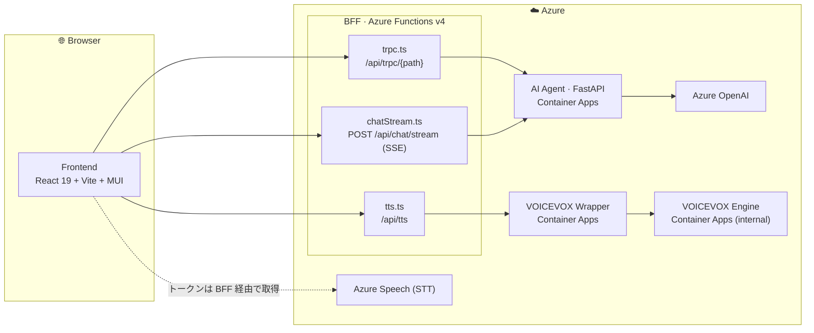

# Mind Inbox — 現行の構造と責務

**いま何がどこにあるか**だけを書く。判断の理由は [ADR](../adr/README.md)、操作手順は [Runbook](../runbooks/README.md)、これからの計画は [`implementation_plan_v2.md`](./implementation_plan_v2.md)。

PoC 期の基本設計書は [`archive/basic_design_poc.md`](archive/basic_design_poc.md) (現行方針をそこから読まない)。

## 全体構成

```mermaid
graph LR
  subgraph Browser["🌐 Browser"]
    FE["Frontend<br/>React 19 + Vite + MUI"]
  end
  subgraph Azure["☁️ Azure"]
    subgraph BFF["BFF · Azure Functions v4"]
      TRPC["trpc.ts<br/>/api/trpc/{path}"]
      STREAM["chatStream.ts<br/>POST /api/chat/stream (SSE)"]
      TTS["tts.ts<br/>/api/tts"]
    end
    AI["AI Agent · FastAPI<br/>Container Apps"]
    VVW["VOICEVOX Wrapper<br/>Container Apps"]
    OAI["Azure OpenAI"]
    SPEECH["Azure Speech (STT)"]
    VVE["VOICEVOX Engine<br/>Container Apps (internal)"]
  end
  FE --> TRPC
  FE --> STREAM
  FE --> TTS
  FE -. "トークンは BFF 経由で取得" .-> SPEECH
  TRPC --> AI
  STREAM --> AI
  TTS --> VVW
  AI --> OAI
  VVW --> VVE
```

フロントは **BFF のエンドポイントだけ**を知る (上記 3 本 + `GET /api/warmup`)。AI Agent / VOICEVOX の URL は BFF の環境変数にしか存在しない。

## 責務

| レイヤ | 責務 | 真実の所在 |
| --- | --- | --- |
| Frontend | 画面と動線。状態は `useConsultation` / `voice/*` の hook が持つ | UI 仕様は MDX (`docs/frontend/ui_specs/`) |
| BFF (tRPC) | アーティファクト生成の組み立て。**チャットの素通しではない**。承認が要るツールは `requiresApproval` で人間に返す | `apps/bff/src/trpc/router.ts` の zod |
| AI Agent | 対話・抽出・整理・プラン生成。LLM 出力が壊れても空結果に落とす防御層を持つ | `app/schemas.py` の pydantic |
| VOICEVOX Wrapper | Engine の薄いラッパ。音声の後処理 | `apps/services/voicevox/` |

依存先が未設定 (`AI_AGENT_BASE_URL` / `VOICEVOX_BASE_URL` が空) なら BFF は**スタブ応答に落ちる**。ローカルで外部サービス無しに動かせる特性なので壊さない。

## API

| 面 | 面の形 | 真実 |
| --- | --- | --- |
| BFF tRPC | `health` / `speech` / `consultation` / `history` / `problem` | zod schema → [OpenAPI は生成物](../api/README.md) |
| BFF 非 tRPC | `POST /api/tts` / `POST /api/chat/stream` (SSE) / warmup | 同上 |
| AI Agent | `/health` `/chat` `/chat/stream` `/extract` `/organize` `/plan` `/approve` | pydantic (`app/schemas.py`) |
| VOICEVOX Wrapper | `/health` `/speakers` `/audio-query` `/synthesize` | `apps/services/voicevox/` |

BFF ↔ AI Agent のスキーマ対称性は L0 契約テスト (`apps/bff/scripts/contract-check.mjs`) が守る。

## ドメインモデル

**Mention → Problem の 2 層**が核 ([ADR 0007](../adr/0007-problem-centric-two-layer-domain-model.md))。詳細は [`domain_model.md`](./domain_model.md) が真実。

## 永続化

**現在は in-memory** (`apps/services/ai-agent/app/repositories.py` の `InMemory*Repository`)。
Repository の Protocol は切ってあるので差し替え可能。耐久ストアの選定は v2 M2 の索引設計と一緒に判断する ([`implementation_plan_v2.md`](./implementation_plan_v2.md) §6)。

**プロセスが落ちるとセッションと承認待ちは消える。** これは既知の制約であり、仕様ではない。

## 音声

| 向き | 経路 | 判断 |
| --- | --- | --- |
| 入力 (STT) | ブラウザ → BFF でトークン取得 → Azure Speech。失敗時はブラウザ認識へ劣化し、**劣化を画面に出す** | [ADR 0023](../adr/0023-server-stt-azure-speech-f0.md) |
| 出力 (TTS) | `/api/tts` → **BFF が文単位に分割して合成・結合** (`tts/ttsService.ts`) → Wrapper → Engine。合成・再生に失敗したらブラウザ読み上げへ劣化し、**理由を画面に出す** | [ADR 0024](../adr/0024-chat-streaming-via-sse-side-channel.md) |

## インフラ

`cicd/iac/` の Bicep が真実 (2 フェーズ: bootstrap → config / [ADR 0003](../adr/0003-two-phase-bicep.md))。
image は ghcr に事前ビルドし、デプロイは不変 sha タグの差し替え ([ADR 0025](../adr/0025-deploy-container-images-by-immutable-sha-tag.md))。
リソースの一覧と役割は [`docs/cicd/iac/`](../cicd/iac/iac-deploy-overview.md)。
