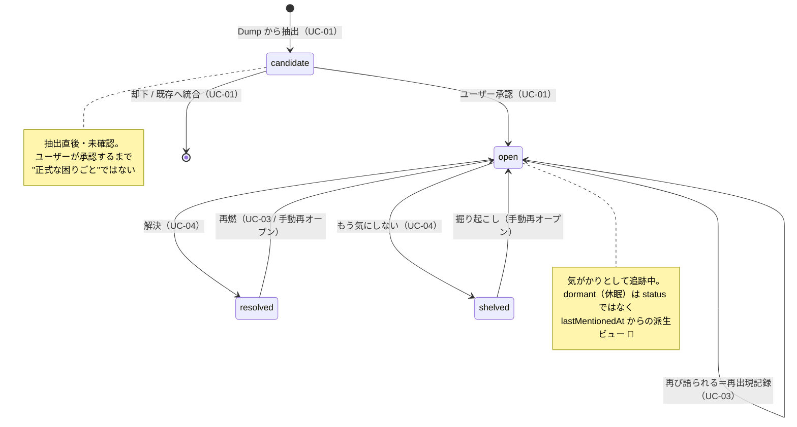

# Mind Inbox — ドメインモデル（プロダクト化フェーズ / Problem 中心）

作成: 2026-06-21 / 対象: `Problem` を集約ルートに据えた v1 のドメインモデル
関連: [`requirements.md`](./requirements.md) / [`use_cases.md`](./use_cases.md) / [`basic_design.md`](./basic_design.md)（§4 を覆す）

> **ステータス: DRAFT（叩き台）**
> この設計は basic_design §4 の**会話中心モデル（集約ルート = Session）を覆す**。確定時に ADR を起こす。
> 🔶 マークは `requirements.md §9` 未決事項に依存（暫定）。

---

## 1. なぜ Problem を集約ルートにするか

PoC の集約ルートは **Session**（`HistoryItem` も 1 セッション = 1 レコード）で、困りごとは `priorities: string[]` に畳まれ、**セッションを跨いで同一物として残らない**。これでは concept_deck §1 の核心「同じ悩みを何度も話している / 継続テーマが見えない」を解けない。

→ **困りごと（Problem）を第一級エンティティに昇格**し、セッションを跨いで生き続ける**追跡単位**にする。Session は「Problem を生む / 再点火するイベント」に格下げする。

---

## 2. 主要エンティティ（暫定属性）

> 属性は叩き台。確定は §9 / レビュー後。

### Problem（集約ルート）

| 属性 | 型（暫定） | 意味 |
| --- | --- | --- |
| `id` | UUID | 同一性のキー |
| `title` | string | 短い見出し（AI 生成 + ユーザー編集可） |
| `body` | string | 困りごとの中身 |
| `labels` | Label[] | 分類タグ 🔶（固定 taxonomy か自由生成か = §9-4） |
| `status` | ProblemStatus | ライフサイクル状態（§3） |
| `originSessionId` | SessionId | 最初に生まれたセッション |
| `recurrences` | Recurrence[] | 再出現の記録（いつ / どのセッションで再び語られたか） |
| `recurrenceCount` | number | 再出現回数（`recurrences` の派生でも可） |
| `plans` | ActionPlan[] | 紐づくアクションプラン（派生物） |
| `createdAt` / `updatedAt` | ISO 8601 | 生成 / 最終更新 |
| `lastMentionedAt` | ISO 8601 | 最後に語られた日時（休眠判定に使う） |
| `resolvedAt` / `shelvedAt` | ISO 8601? | 棚卸し日時 |

### 関連エンティティ

| エンティティ | 役割 | Problem との関係 |
| --- | --- | --- |
| **Session** | 1 回の対話（吐き出しを含む） | 1 Session → 0..N Problem を生成 / 再点火。1 Problem は複数 Session で再出現 |
| **Dump** | セッション内の 1 回の吐き出し（音声/テキスト） | 抽出の入力単位 🔶（§9-1） |
| **Label**（値オブジェクト） | 分類タグ | Problem 0..N : Label 0..N |
| **Recurrence**（値オブジェクト） | 再出現の 1 記録 | Problem 1 : N |
| **ActionPlan** | 行動プラン（既存） | Problem に紐づく派生物。状態に影響しない |

> **LLM はドメインの外**: 抽出・ラベリング・類似判定は LLM が*提案*するが、確定（承認・状態遷移・同一性の最終判断）は Problem 側のルールとユーザーが持つ。LLM は差し替え可能な供給者であって、ルールの所有者ではない。

---

## 3. Problem のライフサイクル（状態遷移図）

### 状態の定義

| 状態 | 意味 | 一覧での既定表示 |
| --- | --- | --- |
| `candidate` | 抽出直後・未確認。ユーザー承認待ち | 確認待ちとして提示 |
| `open` | 気がかりとして追跡中 | 表示する（主役） |
| `resolved` | 解決した | 既定では隠す（参照可） |
| `shelved` | もう気にしない（棚卸し） | 既定では隠す（参照可） |

> **`dormant`（休眠）を状態に持たせない**: 「しばらく触れていない」は、本来 *時間で駆動される遷移* になる。だが v1 はプロアクティブ / スケジューラを範囲外にした（`requirements.md §2.2`）。よって休眠は**保存される状態ではなく `lastMentionedAt` から計算する派生ビュー**として扱う。プロアクティブ・フェーズで初めて、時間トリガによる正式な状態化を検討する。🔶

---

## 4. ユースケース ↔ 状態遷移の対応

| UC | Problem に対する操作 | 遷移 |
| --- | --- | --- |
| UC-01 吐き出して整理 | 新規生成 / 既存へ統合 | `[*] → candidate → open` |
| UC-02 見返す | 読み取りのみ | （遷移なし） |
| UC-03 繰り返しに気づく | 再点火・再出現記録 | `open → open` / `resolved`,`shelved` → `open` |
| UC-04 棚卸し | 解決 / もう気にしない | `open → resolved` / `open → shelved` |
| UC-05 次の一歩 | Plan を派生 | （遷移なし。`plans` に追加） |

→ **ユースケースは、ぜんぶ Problem のライフサイクル上の遷移か読み取り**に落ちる。これが外部設計（UC/SSD）と域モデルの噛み合う点。

---

## 5. 不変条件（invariant / 設計の"高い核"）

覆すと全体に波及するルール。ここを §9 で慎重に決める。

1. **同一性**: 「2 つの Problem が同じ」とは何か。`id` 一致が正だが、再出現検知（UC-03）は「実質同一」をどう判定するか 🔶（§9-3）
2. **粒度**: 1 つの吐き出しを何個の Problem に割るか。割りすぎても束ねすぎても価値が落ちる 🔶（§9-2）
3. **確定はユーザー**: `candidate → open` と再接続は、AI 提案 + **ユーザー承認**で確定する（concept_deck「共同編集」/ FR-8）。AI が単独で `open` を作らない
4. **resolved/shelved も消さない**: 履歴・再燃のために物理削除しない（再出現検知と継続テーマ分析の前提）

---

## 6. オープンクエスチョン（`requirements.md §9` 由来）

| # | 論点 | このモデルへの影響 |
| --- | --- | --- |
| §9-1 | 抽出タイミング（Dump 単位 / セッション終了） | `Dump` の扱い・抽出の入力境界 |
| §9-2 | Problem の粒度 | candidate を何件作るか・分割 UI |
| §9-3 | 同一性 / 再出現判定 | §5-1 の invariant・UC-03 の実現方式 |
| §9-4 | ラベル体系（固定 / 自由生成） | `Label` 値オブジェクトの設計 |

---

## 7. 次のアクション

1. §9 を具体例（『転職どうしよう、でも人間関係も…』）で 1 本通して、粒度・同一性・抽出タイミングの当たりを付ける
2. 確定したら本書の 🔶 を正式化し、属性を確定
3. **ADR**（集約ルート Session → Problem）を起こす → `basic_design.md §4`（データモデル）/ §10（ロードマップ）を更新
