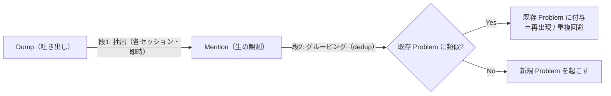
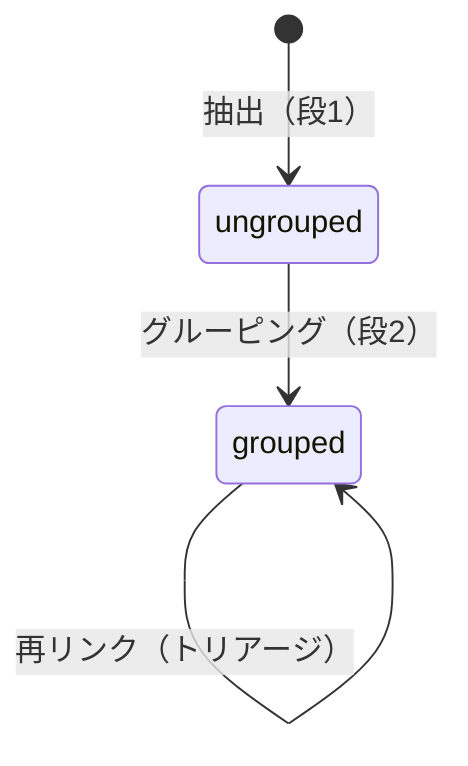
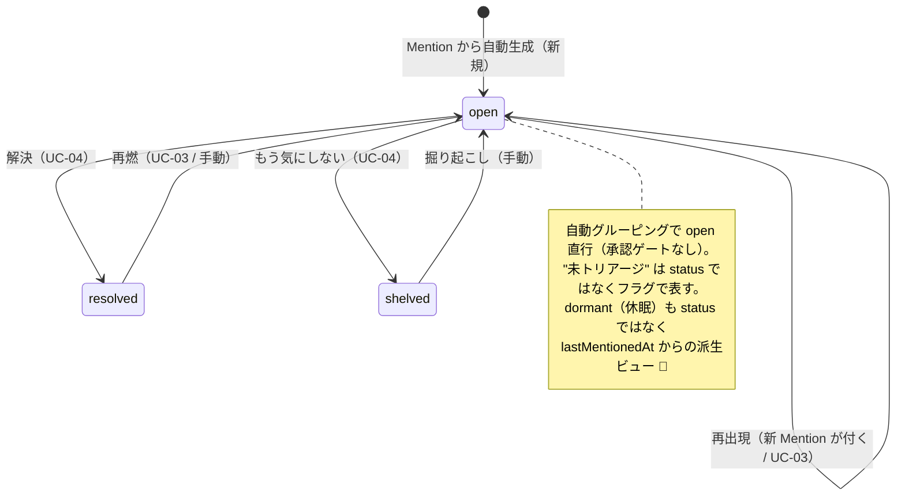

# Mind Inbox — ドメインモデル（プロダクト化フェーズ / 2層: Mention → Problem）

作成: 2026-06-21 / 対象: `Mention`（観測）と `Problem`（集約）の2層モデル
関連: [`requirements.md`](./requirements.md) / [`use_cases.md`](./use_cases.md) / [`basic_design.md`](./basic_design.md)（§4 を覆す）

> **ステータス: DRAFT（叩き台）**
> この設計は basic_design §4 の**会話中心モデル（集約ルート = Session）を覆す**。確定時に ADR を起こす。
> 着想元: PagerDuty のインシデント管理（Alert を Incident に束ね、重複を抑え、繰り返すものを重点化）。
> 🔶 マークは最終確認待ちの判断。

---

## 1. なぜ2層（Mention / Problem）か

PoC の集約ルートは **Session**（困りごと = `priorities: string[]`）で、セッションを跨いで困りごとが残らない。これでは concept_deck §1「同じ悩みを何度も話している / 継続テーマが見えない」を解けない。

PagerDuty 式に、**生の観測**と**追跡する集約**を分ける:

| PagerDuty | 本モデル | 役割 |
| --- | --- | --- |
| Alert（1回の発火） | **Mention**（観測） | 各セッションで表明された困りごと1件。生・不変 |
| Incident（集約） | **Problem**（追跡対象） | 似た Mention を束ねた、状態を持つ追跡単位 |
| Alert Grouping / Dedup | **グルーピング** | 似た Mention を同じ Problem に寄せる＝重複回避 |
| 頻発インシデント | **繰り返す Problem** | Mention 数・頻度 = テーマの強さ |

**この2層が効く理由**: ①重複回避（Mention を寄せる）②後からまとめ直せる（Mention を捨てない）③繰り返し重点（Mention 数 = 強さ）④感情の時系列（後述、感情は Mention に乗る）。

---

## 2. エンティティ

### 2.1 Mention（観測 / = PagerDuty Alert）

> **Mention = ある1回のセッションで、ユーザーが表明した「独立した困りごと1件」の観測記録。**
> 不変・追記専用。いつ・どのセッションで・どう語られたか（＋その時の感情）を**1点の事実**として残す。**解釈ではなく観測**。

| 属性 | 意味 |
| --- | --- |
| `id` | — |
| `sessionId` / `dumpId` | どの吐き出しから出たか（来歴） |
| `createdAt` | 語られた日時 |
| `statement` | 抽出された困りごと本文（正規化済み） |
| `excerpt` | 元発話からの引用（来歴・信頼性。「あなたがこう言ったやつ」） |
| `affect` | **その時の感情 / 切迫感**（← occurrence ごとに変わる。Problem ではなくここに乗る） |
| `proposedTheme` / `proposedTags` | 抽出時の暫定テーマ・タグ |
| `problemId` | 束ね先 Problem（未グルーピングなら null） |
| `groupingConfidence` | 自動グルーピング時の類似スコア |

**Mention でないもの**: 生の発話まるごと（= `Dump`）／チャットメッセージ／追跡対象そのもの（= `Problem`）。
**不変**: 内容・日時は上書きしない。間違いは「再リンク（グルーピングのやり直し）」で直す。

### 2.2 Problem（集約・追跡対象 / = PagerDuty Incident）

> **Problem = 似た Mention を束ねた、状態とライフサイクルを持つ追跡単位。**

| 属性 | 意味 |
| --- | --- |
| `id` | 同一性のキー |
| `title` | 短い見出し（AI 生成 + ユーザー編集可） |
| `summary` | 現在の理解（Mention 群から要約） |
| `theme` | 主テーマ（固定7分類 + 未分類 のいずれか1つ。§2.4） |
| `tags` | 下位の自由タグ（LLM 生成 + ユーザー編集可） |
| `status` | ライフサイクル状態（§4.2） |
| `mentions` | 束ねられた Mention 群（**最低1**。最初が"種"、以降が再出現） |
| `mentionCount` | 言及回数（= `mentions` の派生。繰り返し重点の指標） |
| `plans` | 紐づく ActionPlan（派生物。状態に影響しない） |
| `createdAt` / `lastMentionedAt` | 生成 / 最終言及（休眠判定に使う） |
| `resolvedAt` / `shelvedAt` | 棚卸し日時 |

> **`affect`（感情）は Problem に持たせない**。感情は occurrence ごとに変わるので Mention 側。Problem の「感情の推移」は Mention を時系列に並べて得る。

### 2.3 関連と廃止

```
Dump      1 ──< 0..N  Mention      （1回の吐き出しから0〜複数）
Problem   1 ──< 1..N  Mention      （最低1。種＋再出現）
Mention   N ──> 0..1  Problem      （グルーピング前=未所属、後=1つ）
Problem   1 ──< 0..N  ActionPlan   （派生物）
```

> **`Recurrence` 値オブジェクトは廃止**。再出現 = 既存 Problem に新しい Mention が付くこと、で表現できる。`Problem.mentions` がそのまま再出現履歴。「今月3回目」= 直近の Mention 数。
> **LLM はドメインの外**: 抽出・グルーピング・類似判定を*提案*するが、確定（同一性の最終判断・状態遷移）は Problem のルールとユーザーのトリアージが持つ。差し替え可能な供給者であって、ルールの所有者ではない。

### 2.4 ラベル体系（テーマ + タグ）

ハイブリッド: **主テーマ1つ（固定）＋ 下位の自由タグ（LLM 生成）**。主テーマを1つに正規化することで、横断比較・継続テーマの可視化（UC-02）が成立する。

主テーマは**ライフホイール（人生の輪 / Paul J. Meyer）の8分野を、悩み分類用に仕立て直した7分類 + 未分類**:

| 主テーマ | 拾う悩みの例 |
| --- | --- |
| 仕事・キャリア | 転職・成長実感・評価・働き方 |
| お金 | 収入・支出・将来の経済不安 |
| 心と体 | 睡眠・気分・体調・メンタル |
| 家族・パートナー | 親・配偶者・恋人・子ども |
| 人間関係 | 友人・職場・コミュニティ（親密圏の外） |
| 自己理解・生き方 | 価値観・意味・将来の方向性（標準の"自己成長＋精神性"を統合） |
| 日常・生活 | 住環境・時間の使い方・習慣 |
| 未分類 | テーマ未確定。自動分類の逃げ場 / トリアージで正式テーマへ |

- 主テーマは Problem に**1つ**。複数領域に触れるもの（例: 転職 = `仕事・キャリア`が主、`お金`/`人間関係`にも触れる）は、**主テーマ1つ + 触れる領域は下位タグ**で表す。
- 主テーマはトリアージで付け替え可能。`未分類` はテーマというより未確定状態。

---

## 3. パイプライン（2段）



- **段1 抽出**: 各セッションで**即時**。Dump から Mention 群を抽出して必ず残す。
- **段2 グルーピング**: 意味類似で **自動グルーピング**し、ユーザーが**事後トリアージ**（分割 / 統合 / 棚卸し）で上書きできる（PagerDuty 式 = **A 案で確定**。承認ゲートを挟まない代わりに編集権はトリアージで担保）。
- **グルーピングのトリガ**: v1 = 抽出時に即時で寄せる ＋ ユーザーが「まとめ直し」を実行。**定期自動の再クラスタリングはスケジューラ依存 = 次フェーズ**（proactive、`requirements.md §2.2`）。

---

## 4. ライフサイクル（2層）

### 4.1 Mention — ほぼ状態を持たない（＝事実）



Mention は観測事実なので resolved/shelved を持たない。豊かなライフサイクルは Problem 側だけ。この非対称が「2層に分ける意味」を表す。

### 4.2 Problem — 豊かなライフサイクル



| 状態 | 意味 | 一覧の既定 |
| --- | --- | --- |
| `open` | 気がかりとして追跡中 | 表示（主役） |
| `resolved` | 解決した | 隠す（参照可） |
| `shelved` | もう気にしない（棚卸し） | 隠す（参照可） |

> **`candidate` を廃止**: A 案（自動グルーピング + 事後トリアージ）では Problem は `open` 直行で生まれる。承認待ちの中間状態は不要になり、トリアージは*非ブロッキングな事後編集*になる。
> **`dormant` を状態にしない**: 「しばらく触れていない」は本来*時間駆動の遷移*。v1 はスケジューラ範囲外なので、`lastMentionedAt` から計算する**派生ビュー**として扱う。プロアクティブ・フェーズで正式な状態化を検討。

---

## 5. ユースケース ↔ 遷移の対応

| UC | 操作 | 遷移 |
| --- | --- | --- |
| UC-01 吐き出して整理 | Mention 抽出 → 自動グルーピング | `Dump → Mention → (新規)Problem.open` / 既存へ付与 |
| UC-02 見返す | 読み取り（Mention 数・頻度で並べる） | （遷移なし） |
| UC-03 繰り返しに気づく | 既存 Problem に Mention 付与・再点火 | `open→open` / `resolved`,`shelved` → `open` |
| UC-04 棚卸し | 解決 / もう気にしない | `open → resolved` / `open → shelved` |
| UC-05 次の一歩 | Plan を派生 | （遷移なし。`plans` に追加） |

→ ユースケースは、ぜんぶ **Mention の追加** か **Problem の状態遷移** か **読み取り**に落ちる。

---

## 6. 不変条件（invariant / 設計の"高い核"）

1. **同一性**: Problem の同じさは「**関心の意味**の一致」。原因や言い回しが違っても同じ Problem に束ね、違いは Mention が文脈として運ぶ（例: 睡眠不足は原因が変わっても同じ Problem）。
2. **粒度**: 「**独立して再出現し、独立して解決しうるか**」で割る。それ未満（facet・障害要因）は親 Mention の文脈に抱える（例: 「辞める罪悪感」は「転職」Mention の中）。
3. **Mention は不変・追記専用・物理削除しない**（再出現分析と「まとめ直し」の前提）。
   - **例外: トリアージの `dismiss`（誤抽出の却下）**。dismiss は「実際には観測でないノイズ（誤抽出）」の除去であり、本不変条件の対象外とする。むしろ誤抽出を残すと再出現分析を汚すため、Problem ごと物理削除してよい（v1）。正しい観測に対する resolve/shelve（不変条件5）とは区別する。
4. **確定はユーザー**: 自動グルーピング + 事後トリアージで編集権を担保（concept_deck「共同編集」/ FR-8）。
5. **resolved/shelved も消さない**（再燃・継続テーマ分析の前提）。

---

## 7. §9 オープンクエスチョンへの回答（現時点の決定）

| # | 論点 | 決定 | 状態 |
| --- | --- | --- | --- |
| §9-1 | 抽出タイミング | 段1（抽出）は各セッション即時 / 段2（グルーピング）は分離 | ✅ |
| §9-2 | Problem の粒度 | 「独立再出現・独立解決」で割る。facet は親に抱える | ✅ |
| §9-3 | 同一性 / 再出現判定 | 意味類似で**自動グルーピング** + 事後トリアージ（A案）。原因差は Mention が運ぶ | ✅ |
| §9-4 | ラベル体系 | 主テーマ1つ（固定7分類 + 未分類）+ 下位自由タグ（§2.4） | ✅ |

---

## 8. 次のアクション

1. **ADR** を起こす:（a）集約ルート Session → Problem（b）2層 Mention/Problem + 自動グルーピング方式 + テーマ体系
2. `use_cases.md` の UC-01 / UC-03 を「抽出（段1）→ グルーピング（段2）」分離に更新
3. `basic_design.md §4`（データモデル）/ §10（ロードマップ）を更新
