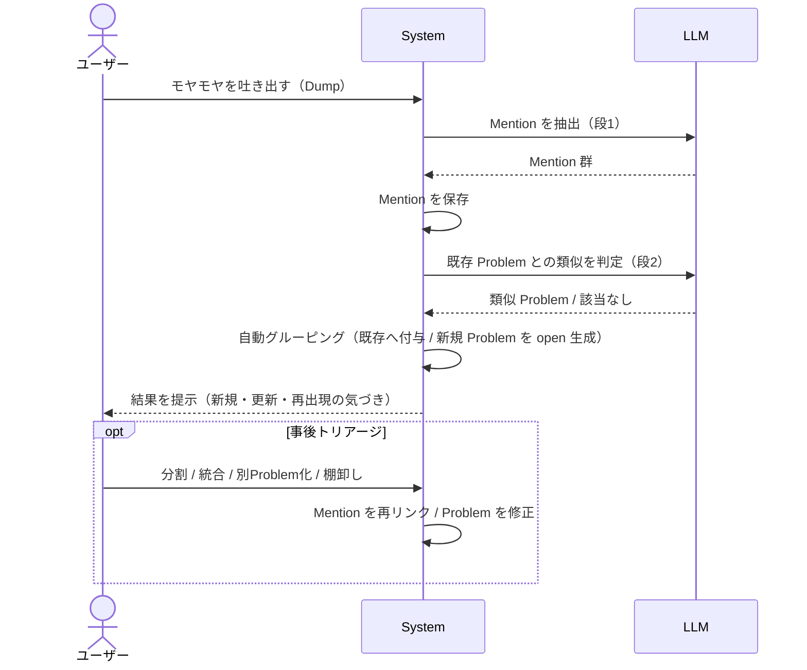
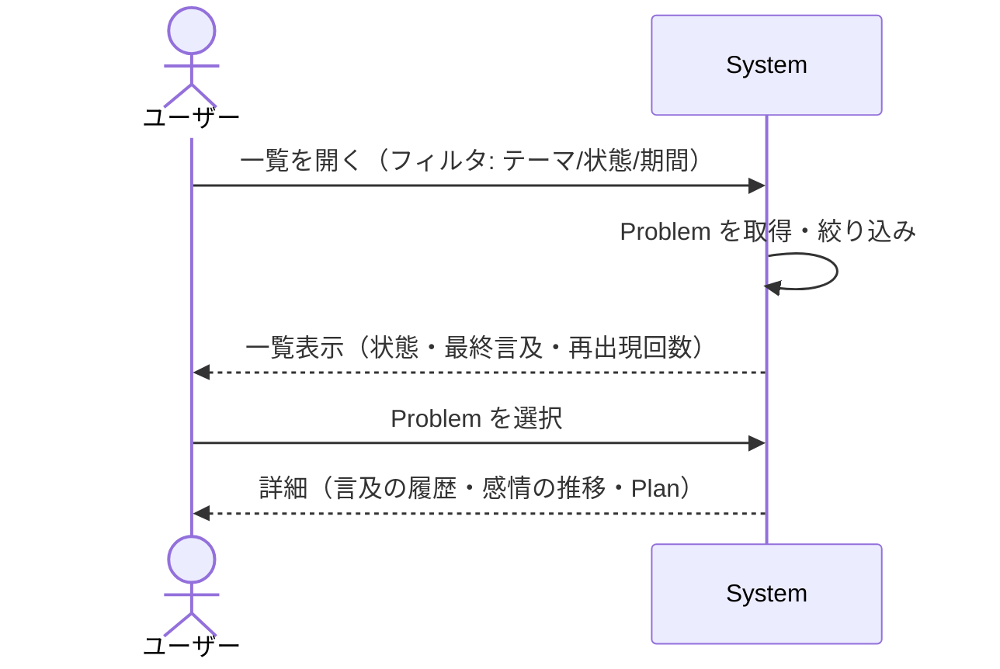
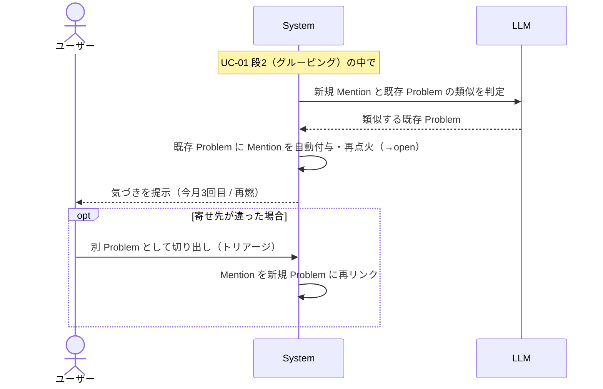
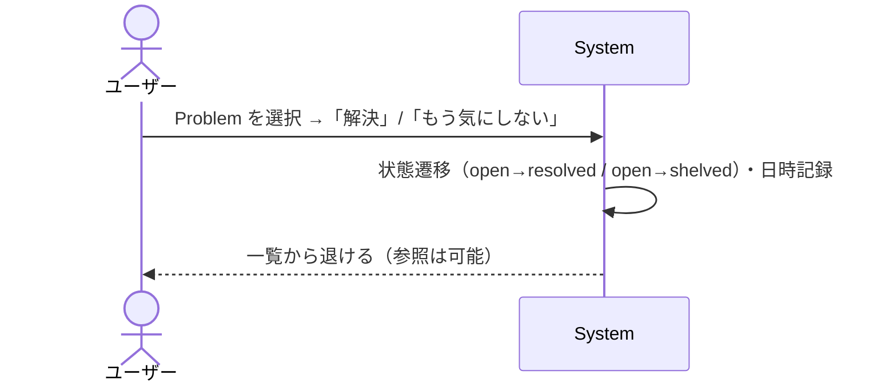
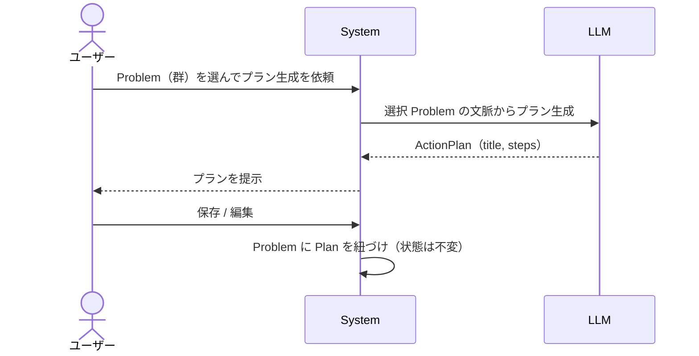

# Mind Inbox — ユースケース仕様（プロダクト化フェーズ / v1）

作成: 2026-06-21 / 対象: `requirements.md` の UC-01〜05 を外部設計レベルで詳細化
関連: [`requirements.md`](./requirements.md) / [`domain_model.md`](./domain_model.md) / [`concept_deck.md`](../concept_deck.md)

> **ステータス: 受け入れテストで検証中**
> UC-01〜05 の基本フローと主要な代替フローは `apps/frontend/e2e-uc/uc0*.spec.ts` が
> **実配線（mock を通さない）で自動検証**している（[ADR 0030](../adr/0030-use-case-acceptance-tests-against-real-wiring.md)）。
> この doc を変えたら対応する spec も直すこと。逆に spec が落ちたら「実装が壊れた」か
> 「この doc が古い」かのどちらかで、放置しないこと。
> **未検証の前提**: 永続化（[#165](https://github.com/yomote/mind-inbox/issues/165)）。
> BFF は in-memory なので、実環境では蓄積が消えて UC-02〜05 の事前条件が崩れうる。
> 各 UC は「文章フロー ＋ システムシーケンス図（SSD）」のセット。
> SSD は **黒箱**で描く: 参加者は `ユーザー` / `System`（中身を見せない）/ 外部サービス（`LLM`）のみ。
> Frontend / BFF / AI Agent への内部分解は**内部設計**（`basic_design.md §5`）の役割で、ここでは扱わない。
> §9 の論点は [ADR 0007](../adr/0007-problem-centric-two-layer-domain-model.md) / [`domain_model.md`](./domain_model.md) で決定済み。用語: **Dump**（生の吐き出し）→ **Mention**（観測）→ **Problem**（集約）。

---

## 共通の前提

- 主アクターは**ユーザー**ただ1人（`requirements.md §4`）。AI はアクターではなく `System` の振る舞い（実体は `LLM` への委譲）。
- 各 UC は Problem のライフサイクル上の**遷移**または**読み取り**に対応する（対応表は `domain_model.md`）。
- 2段処理（[`domain_model.md §3`](./domain_model.md)）: **段1 抽出**（Dump → Mention、各セッション即時）→ **段2 グルーピング**（Mention を意味類似で Problem に自動で寄せる）。Problem は承認ゲートなしで `open` 生成し、ユーザーは**事後トリアージ**で直す（A 案）。

---

## UC-01 モヤモヤを吐き出して困りごとに整理する

| 項目       | 内容                                                                                    |
| ---------- | --------------------------------------------------------------------------------------- |
| 目的       | 未整理の話を、追跡可能な Problem 群に変える                                             |
| 主アクター | ユーザー                                                                                |
| 事前条件   | （任意）過去の Problem が蓄積されていてもよい                                           |
| 事後条件   | Mention が保存され、自動グルーピングで Problem が `open` 生成 / 既存 Problem を更新する |

**基本フロー**

1. ユーザーが音声 / テキストでモヤモヤを吐き出す（Dump）
2. 【段1 抽出】System が Dump から Mention 群を抽出し、保存する
3. 【段2 グルーピング】System が各 Mention を意味類似で既存 Problem に自動グルーピングする。該当がなければ新規 Problem（`open`）を起こす
4. System が結果を提示する（どの困りごとが新規 / 更新されたか。再出現は気づきとして示す → UC-03）
5. （任意）ユーザーが**事後トリアージ**（分割 / 統合 / 別 Problem 化 / 棚卸し）で修正する

**代替・例外フロー**

- 2a. 抽出ゼロ件（雑談・愚痴のみで Problem 化に値しない）→ Mention を作らず「受け止め」だけ返す（concept_deck §3「まず受け止める」）
- 3a. 自動グルーピングが誤る → 手順 5 のトリアージで直す（Mention は不変なので**再リンク**で対応）
- 2b. LLM 失敗 → リトライ / ユーザーが手動で困りごとを 1 件起票

---

## UC-02 溜まった困りごとを見返す

| 項目       | 内容                                            |
| ---------- | ----------------------------------------------- |
| 目的       | 蓄積された Problem を俯瞰し、継続テーマに気づく |
| 主アクター | ユーザー                                        |
| 事前条件   | 1 件以上の Problem が蓄積されている             |
| 事後条件   | （読み取りのみ。状態遷移なし）                  |

**基本フロー**

1. ユーザーが一覧を開き、フィルタを指定する（テーマ / 状態 / 期間）
2. System が Problem 群を取得・絞り込む
3. System が一覧を表示する（状態・最終言及日・再出現回数つき）
4. ユーザーが Problem を選ぶ
5. System が詳細（言及の履歴 = 日時 + 元発話の引用 + そのときの感情、紐づく Plan）を表示する

**代替・例外フロー**

- 1a. 自由文で検索 → 意味検索なら `LLM`/embedding を使う（v1 はテーマ / 全文一致から始めてもよい）
- 2a. 該当ゼロ件 → 空状態の案内（「まだ困りごとがありません」）

---

## UC-03 繰り返している悩みに気づく

| 項目       | 内容                                                                         |
| ---------- | ---------------------------------------------------------------------------- |
| 目的       | 「同じ悩みを何度も話している」を可視化する（concept_deck §1 の直接解決）     |
| 主アクター | ユーザー                                                                     |
| 事前条件   | 照合対象となる過去 Problem が存在する                                        |
| 事後条件   | 既存 Problem が再点火（`resolved`/`shelved` → `open`）し、再出現が記録される |

> UC-01 の段2（グルーピング）の中で自動的に起きる拡張。独立画面ではなく**気づきの提示**が本体。確認ダイアログではなく、自動で寄せて気づきを返し、違えば事後トリアージで直す。

**基本フロー**

1. （UC-01 段2 の中で）System が新規 Mention を既存 Problem に意味類似で自動グルーピングする
2. 対象が `resolved` / `shelved` だった場合は再点火する（→ `open`）。誤検知はユーザーが事後トリアージで戻す
3. System が再出現を記録する（`mentionCount` ++ / `lastMentionedAt` 更新）
4. System が気づきを提示する（例: 「『○○』は今月 3 回目」「解決済みの『○○』が再燃」）

**代替・例外フロー**

- 4a. 寄せ先が違った → ユーザーが事後トリアージで別 Problem として切り出す（Mention を再リンク）
- 1a. 類似が閾値未満 → 新規 Problem として扱う（誤検知で無理に寄せない）

---

## UC-04 困りごとを棚卸しする

| 項目       | 内容                                               |
| ---------- | -------------------------------------------------- |
| 目的       | 片付いた / もう気にしない Problem を一覧から退ける |
| 主アクター | ユーザー                                           |
| 事前条件   | 対象 Problem が `open`                             |
| 事後条件   | Problem が `resolved` または `shelved` に遷移する  |

**基本フロー**

1. ユーザーが Problem を選び、「解決」または「もう気にしない」を選ぶ
2. System が状態を遷移させる（`open → resolved` / `open → shelved`）、日時を記録する
3. System が既定の一覧から外す（後から参照は可能）

**代替・例外フロー**

- 1a. 解決済み / 棚卸し済みを後から掘り起こす → `→ open` に戻す（再オープン）

---

## UC-05 困りごとから次の一歩を作る

| 項目       | 内容                                                            |
| ---------- | --------------------------------------------------------------- |
| 目的       | Problem を行動に接続する（既存のプラン生成機能の再接続）        |
| 主アクター | ユーザー                                                        |
| 事前条件   | 1 件以上の `open` な Problem がある                             |
| 事後条件   | ActionPlan が生成され、Problem に紐づく（Problem の状態は不変） |

**基本フロー**

1. ユーザーが 1 つ以上の Problem を選び、プラン生成を依頼する
2. System が選択 Problem の文脈を LLM に渡し、ActionPlan を生成させる
3. System がプランを提示する
4. ユーザーが保存 / 編集する
5. System が Problem に Plan を紐づける（**状態は変えない**＝派生物）

**代替・例外フロー**

- 0a. 望まれない限りプランを出さない（concept_deck §4「望まれたときだけ次の一歩」）。本 UC は**ユーザー起点でのみ**発火する

---

## 決定済み事項（[ADR 0007](../adr/0007-problem-centric-two-layer-domain-model.md) / [`domain_model.md §7`](./domain_model.md)）

- **抽出タイミング**: 段1 抽出は各セッション即時 / 段2 グルーピングは分離
- **Problem の粒度**: 「独立して再出現・独立して解決しうるか」で割る（facet は親 Mention に抱える）
- **同一性 / 再出現**: 意味類似で自動グルーピング + 事後トリアージ（原因差は Mention が運ぶ）
- **ラベル**: 主テーマ1つ（固定7分類 + 未分類）+ 下位自由タグ
