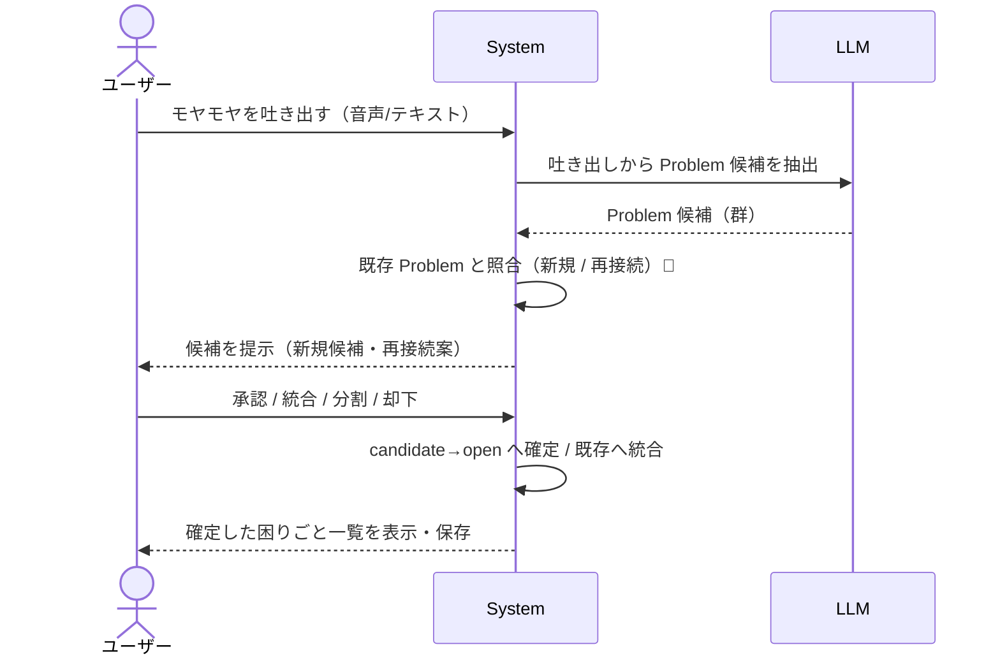
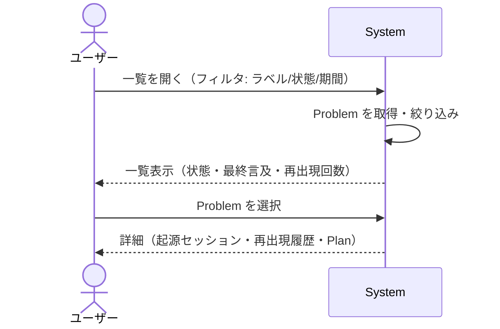
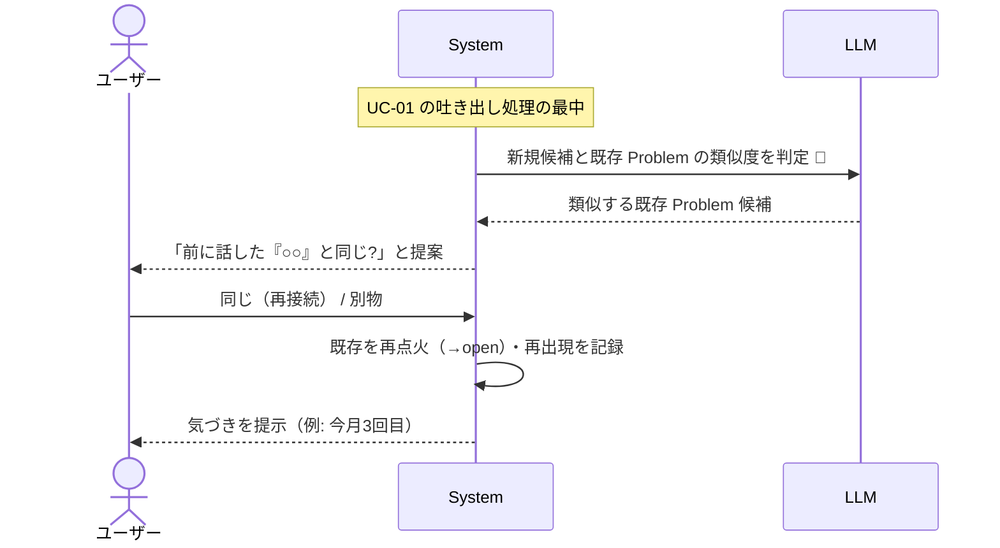
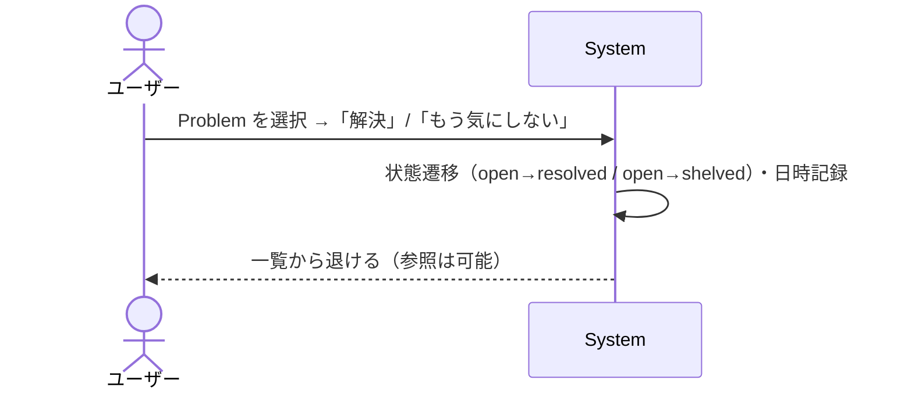
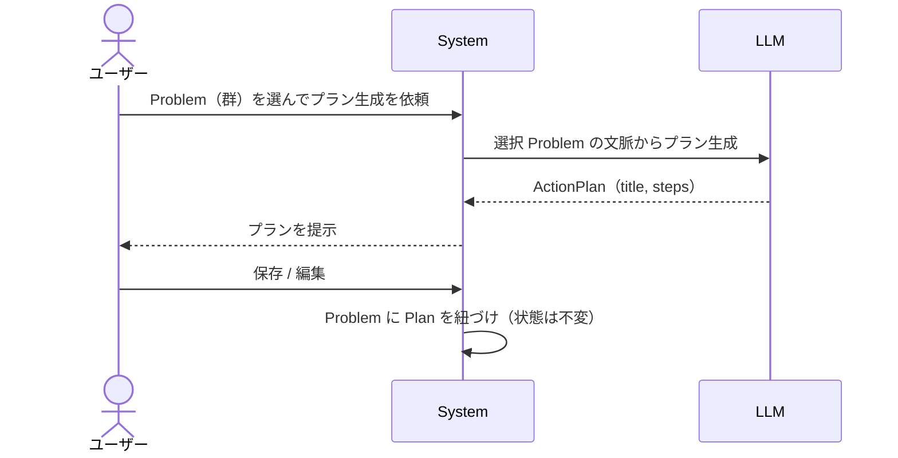

# Mind Inbox — ユースケース仕様（プロダクト化フェーズ / v1）

作成: 2026-06-21 / 対象: `requirements.md` の UC-01〜05 を外部設計レベルで詳細化
関連: [`requirements.md`](./requirements.md) / [`domain_model.md`](./domain_model.md) / [`concept_deck.md`](../concept_deck.md)

> **ステータス: DRAFT（叩き台）**
> 各 UC は「文章フロー ＋ システムシーケンス図（SSD）」のセット。
> SSD は **黒箱**で描く: 参加者は `ユーザー` / `System`（中身を見せない）/ 外部サービス（`LLM`）のみ。
> Frontend / BFF / AI Agent への内部分解は**内部設計**（`basic_design.md §5`）の役割で、ここでは扱わない。
> 🔶 マークは `requirements.md §9` の未決事項に依存する箇所（暫定の前提を置いている）。

---

## 共通の前提

- 主アクターは**ユーザー**ただ1人（`requirements.md §4`）。AI はアクターではなく `System` の振る舞い（実体は `LLM` への委譲）。
- 各 UC は Problem のライフサイクル上の**遷移**または**読み取り**に対応する（対応表は `domain_model.md`）。
- 🔶 抽出タイミングの前提: 本書では「**1 回の吐き出し（Dump）を区切りに、まとめて抽出する**」を暫定採用（発話ごと同期ではなく、吐き出し終了をトリガにする）。§9-1 で確定する。

---

## UC-01 モヤモヤを吐き出して困りごとに整理する

| 項目 | 内容 |
| --- | --- |
| 目的 | 未整理の話を、追跡可能な Problem 群に変える |
| 主アクター | ユーザー |
| 事前条件 | （任意）過去の Problem が蓄積されていてもよい |
| 事後条件 | 0〜N 個の Problem が `open` で保存される / 既存 Problem に統合される |

**基本フロー**

1. ユーザーが音声 / テキストでモヤモヤを吐き出す
2. System が吐き出しを LLM に渡し、Problem 候補（群）を抽出させる
3. System が候補を既存 Problem と照合し、新規か再接続かを判定する 🔶（同一性判定 = §9-3）
4. System が候補を提示する（新規候補 / 既存への再接続案）
5. ユーザーが各候補を **承認 / 統合 / 分割 / 却下** する
6. System が確定し、`candidate → open` に遷移、または既存 Problem に統合する
7. System が確定した Problem 一覧を保存・表示する

**代替・例外フロー**

- 2a. 抽出ゼロ件（雑談・愚痴のみで Problem 化に値しない）→ Problem を作らず「受け止め」だけ返す（concept_deck §3「まず受け止める」）
- 5a. ユーザーが候補を分割 → 1 候補が複数 Problem になる 🔶（粒度 = §9-2）
- 2b. LLM 失敗 → リトライ / ユーザーが手動で困りごとを 1 件起票

---

## UC-02 溜まった困りごとを見返す

| 項目 | 内容 |
| --- | --- |
| 目的 | 蓄積された Problem を俯瞰し、継続テーマに気づく |
| 主アクター | ユーザー |
| 事前条件 | 1 件以上の Problem が蓄積されている |
| 事後条件 | （読み取りのみ。状態遷移なし） |

**基本フロー**

1. ユーザーが一覧を開き、フィルタを指定する（ラベル / 状態 / 期間）
2. System が Problem 群を取得・絞り込む
3. System が一覧を表示する（状態・最終言及日・再出現回数つき）
4. ユーザーが Problem を選ぶ
5. System が詳細（起源セッション、再出現履歴、紐づく Plan）を表示する

**代替・例外フロー**

- 1a. 自由文で検索 → 🔶 意味検索なら `LLM`/embedding を使う（§9 関連。v1 はラベル / 全文一致から始めてもよい）
- 2a. 該当ゼロ件 → 空状態の案内（「まだ困りごとがありません」）

---

## UC-03 繰り返している悩みに気づく

| 項目 | 内容 |
| --- | --- |
| 目的 | 「同じ悩みを何度も話している」を可視化する（concept_deck §1 の直接解決） |
| 主アクター | ユーザー |
| 事前条件 | 照合対象となる過去 Problem が存在する |
| 事後条件 | 既存 Problem が再点火（`dormant`/`resolved` → `open`）し、再出現が記録される |

> UC-01 の吐き出し中に System が検知して割り込む形（拡張）として発生する。独立画面ではなく**気づきの提示**が本体。

**基本フロー**

1. （吐き出しの最中）System が新規候補と既存 Problem の類似度を判定する 🔶（§9-3）
2. System が「これは前に話した『○○』と同じ?」と再接続を提案する
3. ユーザーが「同じ（再接続）」/「別物」を選ぶ
4. System が既存 Problem を再点火し、再出現を記録する（回数++ / 最終言及日を更新）
5. System が気づきを提示する（例: 「『○○』は今月 3 回目」）

**代替・例外フロー**

- 3a. ユーザーが「別物」→ 新規 Problem として UC-01 の流れに戻す
- 1a. 類似が閾値未満 → 何も提案しない（誤検知でユーザーを煩わせない）

---

## UC-04 困りごとを棚卸しする

| 項目 | 内容 |
| --- | --- |
| 目的 | 片付いた / もう気にしない Problem を一覧から退ける |
| 主アクター | ユーザー |
| 事前条件 | 対象 Problem が `open`（または `dormant`） |
| 事後条件 | Problem が `resolved` または `shelved` に遷移する |

**基本フロー**

1. ユーザーが Problem を選び、「解決」または「もう気にしない」を選ぶ
2. System が状態を遷移させる（`open → resolved` / `open → shelved`）、日時を記録する
3. System が既定の一覧から外す（後から参照は可能）

**代替・例外フロー**

- 1a. 解決済み / 棚卸し済みを後から掘り起こす → `→ open` に戻す（再オープン）

---

## UC-05 困りごとから次の一歩を作る

| 項目 | 内容 |
| --- | --- |
| 目的 | Problem を行動に接続する（既存のプラン生成機能の再接続） |
| 主アクター | ユーザー |
| 事前条件 | 1 件以上の `open` な Problem がある |
| 事後条件 | ActionPlan が生成され、Problem に紐づく（Problem の状態は不変） |

**基本フロー**

1. ユーザーが 1 つ以上の Problem を選び、プラン生成を依頼する
2. System が選択 Problem の文脈を LLM に渡し、ActionPlan を生成させる
3. System がプランを提示する
4. ユーザーが保存 / 編集する
5. System が Problem に Plan を紐づける（**状態は変えない**＝派生物）

**代替・例外フロー**

- 0a. 望まれない限りプランを出さない（concept_deck §4「望まれたときだけ次の一歩」）。本 UC は**ユーザー起点でのみ**発火する

---

## 未確定事項（`requirements.md §9` と対応）

- §9-1 抽出タイミング → 本書は「吐き出し単位でまとめて抽出」を暫定採用（UC-01 共通前提）
- §9-2 Problem の粒度 → UC-01 5a「分割」の挙動に直結
- §9-3 同一性判定 → UC-01 手順 3 / UC-03 全体の前提
- これらが確定したら、各 SSP の 🔶 箇所を正式化する
