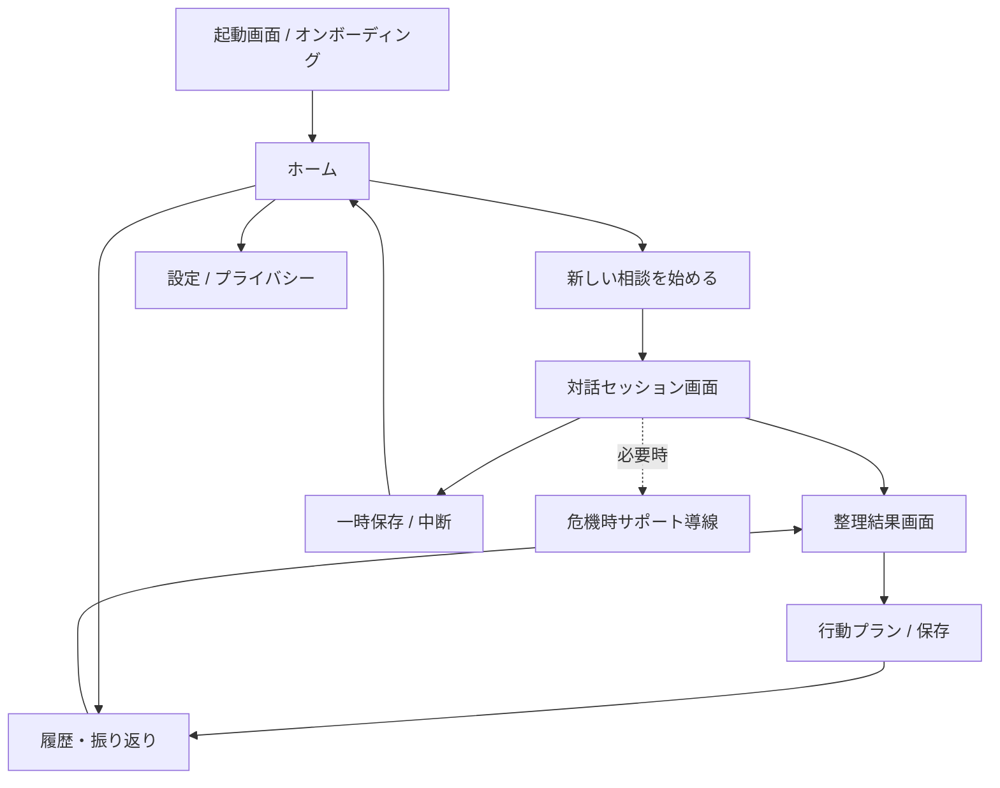

# 画面遷移図

```mermaid
flowchart TD
    A[起動画面 / オンボーディング] --> B[ホーム]
    B --> C[新しい相談を始める]
    C --> D[対話セッション画面]
    D --> E[整理結果画面]
    E --> F[行動プラン / 保存]
    F --> G[履歴・振り返り]

    B --> G
    B --> H[設定 / プライバシー]
    D --> I[一時保存 / 中断]
    I --> B
    G --> E

    D -.必要時.-> J[危機時サポート導線]
```
