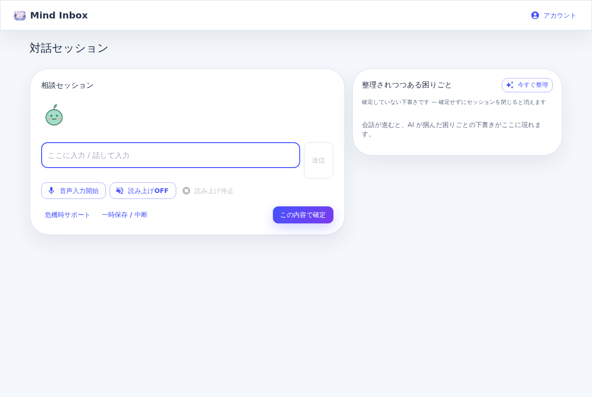
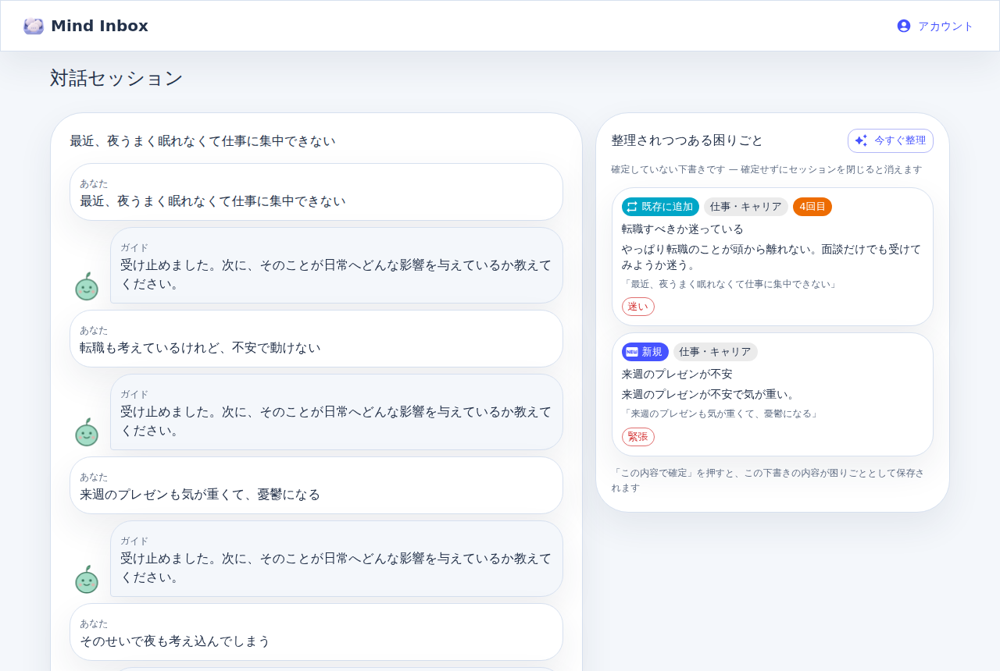
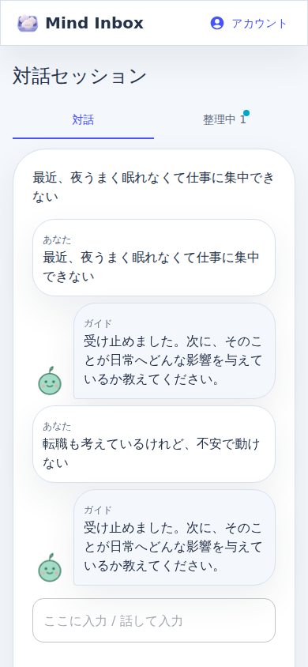
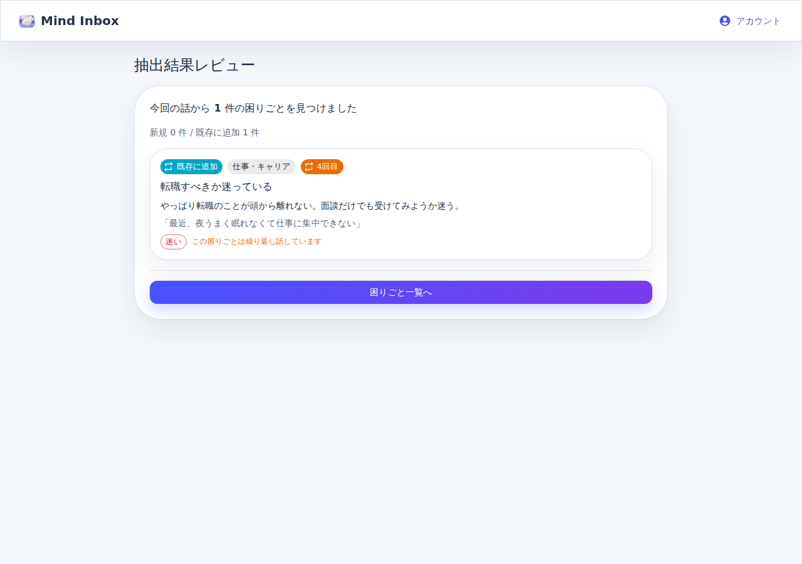

import { SessionSpecPreview } from "../../../frontend/src/spec/previews/SessionSpecPreview";

## 対話セッション画面

<SessionSpecPreview />

## メタ情報

- 実装画面キー: `session`
- 実装ファイル: `frontend/src/Layout.tsx`

## 1. 目的

ユーザーの入力とAIの応答を時系列で表示し、対話の区切りで**困りごとを抽出**して抽出結果レビューへ進むための対話を行う。セッションからの出口は抽出 1 本（旧「整理結果へ」は [ADR 0034](../../adr/0034-remove-legacy-session-centric-flow.md) で撤去）。

## 2. ユーザーがこの画面で達成すること

- 今抱えている悩みを言語化する
- AIからの問いかけで視点を整理する
- 必要に応じて危機時サポートや一時中断に遷移する
- 対話の区切りで困りごとを抽出し、抽出結果レビューへ進む（主導線）

## 3. 主要ユースケース

1. 新規相談を開始する
2. 会話を継続する
3. 困りごとを抽出して抽出結果レビューへ進む（セッションからの唯一の出口）
4. セッションを一時中断する
5. 危機時サポートへ遷移する

### 3.1 開始直後の挙動（Issue #241 / 2026-08-11 PO 裁定で挨拶を撤去）

- **開始直後はユーザーの発話から始める**。AI の挨拶（毎回同じ文言の初手）は表示も読み上げもしない — 毎回同じ文言の読み上げが無駄な待ち時間になっていた（PO 実使用フィードバック）
- 空入力で開始した場合（home.mdx: テーマ入力なしで直接対話開始が既定 — #110 でテーマ入力画面は廃止）: 会話領域は空のまま、**入力欄にフォーカスした画面**で始まる。マスコット（§5.6）の待機表現が「聞く準備ができている」ことを示す — かつての懸念「無言の白画面」はマスコット導入（ADR 0039 D5）で解消する前提の変更
- 相談テーマを入力して開始した場合: そのテーマを最初のユーザー発話として扱い、AI の応答から始まる（現状維持）
- 将来拡張（未実装 / design-gate 対象）: 蓄積された Problem（再出現・休眠）を踏まえた問いかけを AI の初手にする案（#102）は「初手の存在自体が消えた」ため前提が変わる

## 4. レイアウト構成

**2 ペイン構成（Issue #187 / #433 / ADR 0039）**: 左が対話、右は**タブ 2 枚**（「**AI の整理**」＝既定 / 「**下書き N**」）の読み取り専用ペイン（§5.8）。md 以上の幅では左右並列（左 3 : 右 2）、md 未満では「対話 / 整理」のタブ切替（§5.8）。**mock / real どちらのビルドでも 2 ペイン**（real は BFF の `consultation.preview` に結線済み — #187 / §5.8）。切り戻しが要るときは api 層の `previewSupported` を false にすると従来の 1 ペインに戻る。

- ヘッダー
  - 画面タイトル（固定ヘッダー）
  - ホームボタン
- 対話ペイン（左）
  - 会話領域
    - AIメッセージ（マスコット + 吹き出し / §5.6）
    - ユーザーメッセージ
    - 送信中のローディング（送信ボタンに表示）
  - フッター
    - テキスト入力欄
    - 送信ボタン
    - 危機時サポートボタン
    - 一時保存 / 中断ボタン
    - この内容で確定ボタン（主導線 / primary。プレビュー無効環境では「困りごとを抽出」）
- 整理ペイン（右 / §5.8）
  - タブ「AI の整理」（既定）/「下書き N」+「今すぐ整理」ボタン（タブ共通）
  - 更新中の表示 / 更新失敗の警告（タブ共通）
  - 「AI の整理」タブ: 実数サマリ（話題 N / 確定・仮説・未探索）+ 表示切替（図 / 箇条書き）+ マインドマップ図または箇条書きツリー + 凡例 + 「未探索の枝が 0 になったら一区切り」の条件文
  - 「下書き」タブ: 「確定していない下書きです」の注記 + 下書きカード一覧（または空状態の案内）

## 5. UI要素一覧

### 5.1 ヘッダー

- タイトル: 「相談中」
- 上部共通ナビ: 「ホーム」

### 5.2 会話領域

- 時系列でメッセージを表示
- AI応答中は送信ボタンにローディングを表示
- メッセージ本文は改行を保持して表示
- **AI 応答はトークン逐次表示 (ストリーミング)**: 応答生成中は AI メッセージバブルが先に現れ、届いたテキストから順に伸びていく。生成中はバブル末尾にキャレット (▍) を表示する (#120)
- ストリーミングが使えない環境 (BFF 旧版 / 通信断) では従来どおり全文一括表示にフォールバックする。逐次表示は強化であり、対話の成立に必須ではない

### 5.3 入力欄

- プレースホルダ: 「ここに入力」
- 最大文字数: 未制限（現実装）
- 空文字では送信不可

### 5.4 音声入力（Issue #121 / #186 / #228 / ADR 0023）

「1〜2 分話し続ける」を成立させるため、音声入力は次の仕様とする。

- **マイクトグル**: 「音声入力開始」/「音声入力停止」ボタン。ユーザーが止めるまで聞き続ける
- **押した瞬間に始まる（#186）**: マイクの open は**タップの同期処理の中**で行う。iOS Safari はユーザージェスチャの外で開いたマイクを許可済みでも実質無効にするため、トークン取得や SDK ロードを待ってから開くと「押しても無反応」になる。トークンと SDK は**セッション画面を開いた時点で先に用意**しておき、押下時は同期で開始する。準備が間に合っていなければ、待たせずその場でブラウザ認識を開始する（この認識セッションの途中でエンジンを差し替えない）
- **押したら入力欄にフォーカスを移す（#186）**: 押した後にユーザーが入力欄をクリックし直さないと手直し・送信できない、という往復を作らない
- **認識エンジンの選択**（ユーザーには自動・非設定）:
  - サーバー STT（Azure Speech）が使える環境では優先して使う。BFF が発行する一時トークンで接続し、SPA にキーは渡らない
  - トークン発行不可（mock / ローカル / 未プロビジョニング）の場合は **Web Speech API に静かに自動フォールバック**する（想定内なので警告は出さない）
  - **予期しない失敗**（トークン取得エラー / 接続断 / 無料枠停止など）でブラウザ認識に落ちた場合は、エンジンチップを警告色の「ブラウザ認識 (高精度認識に接続できず)」にして**劣化していることを見せる**（併せて console にエラーを残す）。「動いてはいるが精度が落ちている」を無言にしない
  - どちらも使えないブラウザでは警告文を表示しボタンを disabled にする
- **自動再開（Web Speech 時）**: エンジンが無音・時間制限で勝手に止まっても、ユーザーが停止するまで自動で再開する。再開境界で final 化されなかった interim テキストは**捨てずに入力欄へ縫い込む**（発話の末尾欠落を防ぐ）
- **確定テキストの蓄積**: 確定（final）した認識結果は入力欄へ改行区切りで追記される。認識中（interim）のテキストは**入力欄の中**に確定テキストの続きとして表示する（#186）。入力欄の外に出すと、喋っている最中は入力欄が空に見えて「入っていない」と受け取られる
- **認識中の入力欄は読み取り専用**: 表示が「確定テキスト + 未確定テール」の合成のため、直接編集させると確定時に二重に入る。停止すれば未確定分は確定し、普通に編集できる
- **録音状態の可視化**:
  - 押下からマイクが開くまでは「マイクを準備中…」、開いた後は「聞いています **m:ss**」と**別の表示**にする（#186）。この区間に喋られた内容は落ちるので、「押した = もう聞いている」と誤解させない
  - 使用中のエンジン（高精度認識 / ブラウザ認識）をチップで表示する
- **ボタンの有効・無効は「実際に開始できるエンジンがあるか」で決める**: 「BFF があるなら使えるはず」で有効にすると、押して初めて非対応と分かる（#186）
- **エラー**: マイク権限・デバイス起因は明示メッセージで停止。無音などの無害なエラーは表示せず継続する
- **読み上げ中はエコーを拾わない（#228）**: TTS の再生中（ずんだもんの WAV / ブラウザ読み上げのどちらでも）に届いた認識結果（interim / final）は**破棄**し、入力欄へ流さない。スピーカーから出た合成音声をユーザー発話として拾う誤入力を防ぐ。再生が終わると**自動で**認識に戻る（ユーザーの再操作は不要）。どの認識エンジン（高精度認識 / ブラウザ認識）との組み合わせでも同じに振る舞う
  - **エンジン自体は止めない**: Azure Speech の再開はトークン + マイク open の非同期列で、再生終了時点にはユーザージェスチャが無く iOS Safari では再開が静かに失敗する（#186 と同じ罠）。エンジンは動かしたまま結果を堰き止める
  - **尻尾も破棄する**: 認識エンジンの final 化は再生停止より遅れて届くため、再生終了直後（猶予時間内）に届いた認識結果は**無条件に**破棄する。エンジンが尻尾を持っているかは interim の有無から判定できない（interim を経ず final だけ届く経路が両エンジンにある）ため、条件付きにしない。エンジンは止めていないので、猶予内に**始まった**ユーザー発話は猶予後の final に全文入って届く — 失われるのは猶予内に確定まで済む短い発話のみ（エコー混入より安全側）
  - **再生開始時点の未確定 interim はユーザー発話**なので、破棄せず確定させてから堰き止める（発話末尾を黙って消さない）
  - **止まっていることを見せる**: この間はユーザー自身の発話も破棄されるため、「聞いています」ではなく「読み上げ中は音声入力を一時停止中」チップを表示する

### 5.5 音声出力（ずんだもんの読み上げ / Issue #150 / #185）

ガイドの発話は VOICEVOX（ずんだもん）で読み上げる。**「ずんだもんの声で鳴ったか」は仕様であり、鳴らなかったこと・別の声に置き換わったことを無言にしない。**

- **既定の経路**: BFF `/api/tts` で合成した WAV を再生する。これが本来の体験（キャラクターの声）
- **最初の音までを短くする（#185）**: 全文を 1 本に結合してから再生すると、待ち時間が「最後の 1 文の合成完了まで」になる。BFF に読み上げ単位の文を割ってもらい（`/api/tts` の `plan=true`）、**1 文目が合成できた時点で再生を始めて**後続を順に継ぐ。文分割の真実は BFF 側に置き、フロントは返ってきた文字列をそのまま投げ返すだけで自前では切らない（ADR 0024）
- **待たせていることを見せる（#185）**: 合成中と再生中を**別の状態**として表示する（「ずんだもんが準備中…」/「読み上げ中」）。どちらでも読み上げ停止で打ち切れる。合成には数秒かかるので、無表示のままにすると「待てば鳴るのか、もう終わったのか」が判別できない
- **途中で合成に失敗しても無言で切らない**: 残りのテキストをブラウザ読み上げで継ぎ、劣化を表示する
- **再生の解錠**: 合成には数秒かかり、再生はタップから離れた時点で始まる。ブラウザの自動再生ポリシーに弾かれないよう、**ユーザー操作の中で音声要素を一度再生して解錠**し、以降はその要素を使い回す。ブラウザ内蔵読み上げ（Web Speech）の解錠とは別物であり、両方を解錠する
- **フォールバック**（ブラウザ内蔵読み上げ = ずんだもんではない声）に落ちるのは次の場合。**いずれも「別の声になっている」ことを画面に表示する**:
  - 合成できない（未結線 = 204 / 認証・wrapper 障害）: 「ずんだもんの音声を合成できませんでした。ブラウザの読み上げに切り替えています」
  - 再生をブラウザにブロックされた: 「ブラウザに音声再生をブロックされました。画面をタップすると、ずんだもんの声に戻ります」
- **読み上げの速さはユーザーが決める（#242）**: 設定画面のスライダー（0.75×〜2.00×／既定 1.00×／settings.mdx）で決めた倍率で読み上げる。**ずんだもんの合成（VOICEVOX の `speedScale`）とブラウザ読み上げ（`SpeechSynthesisUtterance.rate`）の両方に同じ倍率を適用する** — 片方だけに配ると、フォールバックした瞬間だけ速度が等倍に戻り「たまに設定が効かない」に見える。速度は合成音声のキャッシュキー（フロント・BFF とも）に含める。含めないと、先行合成（prefetch）が焼いた前の速度の音がそのまま再生され、**設定を変えても音が変わらない**まま普通に鳴る
- **mock デモ（standalone）** では BFF が無いため、最初からブラウザ読み上げを使う（想定内なので警告は出さない）
- **観測**: 実際に使われた出力経路を `data-voice-output` 属性（`voicevox` / `browser-fallback` / `idle`）で公開する。L4 live E2E はこれを検証し、「WAV は 200 で返っているのに実際は別の声だった」を検知する

### 5.6 キャラクター表示（マスコット / Issue #229 / ADR 0039 D5）

AI 応答の主体を画面上のキャラクターとして見せる。文字と声が別々のシステムに見える状態（テキストがぼんと出て、数秒後に音声だけ始まる）を作らない。

- **AI 応答は独自マスコットの吹き出しで表示する**: 会話領域の AI メッセージは、マスコット（Mind Inbox のシンプルな SVG キャラクター）+ 吹き出しのレイアウトで描画する。ユーザーメッセージにはマスコットを付けない
- **マスコットは独自のインライン SVG**（ADR 0039 D5）: ライセンスフリーで、後から差し替え可能な Avatar 部品（`components/session/MascotAvatar.tsx`）として実装する。ずんだもんの立ち絵は使わない（声の VOICEVOX 利用は継続）
- **状態 3 種で表現が変わる**（発話待ちを「壊れてる?」にしない）:

  | 状態                  | いつ                                                                                           | 表現                                                             |
  | --------------------- | ---------------------------------------------------------------------------------------------- | ---------------------------------------------------------------- |
  | `idle`（待機）        | 応答も読み上げも進行していない                                                                 | 通常の表情。ゆっくり浮遊                                         |
  | `preparing`（準備中） | AI 応答の生成中（ai-thinking / ai-streaming）または音声合成中（「ずんだもんが準備中…」の区間） | 考えている / 喋ろうとしている表情 + ローディング的アニメーション |
  | `speaking`（発話中）  | 読み上げの再生中                                                                               | 口が動く + 音波の表現                                            |

- **状態を反映するのは「アクティブな吹き出し」のマスコット 1 体だけ**: ストリーミング中の吹き出し、なければ最新の AI メッセージの吹き出し。過去のメッセージのマスコットは常に `idle`。まだ AI の返事が無い生成待ち（最後のメッセージがユーザー発話で loading 中）は、マスコット + 準備中表現のプレースホルダ吹き出しを出す（無反応の空白を作らない）
- **機械検証**: マスコット要素は `data-mascot-state`（`idle` / `preparing` / `speaking`）を公開し、E2E がキャラ状態を検証できるようにする
- **`prefers-reduced-motion: reduce` を尊重する**: 動きの低減を選んだ環境ではアニメーションを止める（表情の切り替えは静的に維持する）
- ストリーミングのキャレット表示（§5.2）や読み上げの状態チップ（§5.5）などの既存挙動は変えない — マスコットは追加の表現であり置き換えではない

### 5.7 stub 応答の警告バナー（Issue #146 / ADR 0039 D6）

BFF が stub フォールバック応答（`AI_AGENT_BASE_URL` 未設定）を返しているとき、**本物のふりをした偽応答を無言で表示しない**。

- BFF は stub 応答に機械判別フラグ `stubbed: true`（optional / 後方互換）を載せる。真実は BFF の tRPC zod schema（`ChatReplySchema` / `consultation.extract` の出力）
- フロントはフラグを見て警告バナー **「AI サービス未接続 — スタブ応答を表示中」** を表示する（MUI Alert / `data-stub-banner` 属性で機械検証可能）
- バナーは stub 応答を受け取った時点で表示し、実応答（フラグ無し）を受け取ったら消す — 「今画面に出ているものが偽物かどうか」を反映する
- stub 挙動そのものは変えない（外部サービス無しで BFF が動き続けるのは ADR 0013 の設計）
- mock デモ（`VITE_USE_MOCK=true` / standalone）は BFF を呼ばない自己完結モードであり stub とは別物。バナーは出さない

### 5.8 右ペイン: 「AI の整理」/「下書き」（Issue #187 / #433 / ADR 0039 D1–D4）

対話しながら「AI が何を掴んだか」が見える読み取り専用ペイン。抽出を一発勝負にしない。

**タブ 2 枚で併存する（#433 / 2026-08-15 PO 裁定 1）**: 既定タブは「**AI の整理**」（思考整理マップ / 下記 5.8.1）、もう 1 枚が「**下書き N**」（従来の抽出プレビュー / 5.8.2）。マップは下書きの**置き換えではない** — 下書きカードを消すと「この内容で確定」の「この内容」が画面から消え、確定が再抽出に戻る（ADR 0039 D3 が名指しで避けた事故）。既定をマップにするのは「AI がどう思っているか、思考の整理過程が見たい」という PO の原意向を既定の視界に置くため。

**両タブは同じ 1 回の更新の結果**: マップも下書きも `consultation.preview` の**同じ応答**から来る（追加の LLM 呼び出しは 0 / 裁定 2）。したがって「今すぐ整理」ボタン・更新中の表示・更新失敗の警告は**タブの外側に 1 組だけ**置く（タブごとに更新ボタンを置くと「どちらを押したか」で結果が違うように見える）。

#### 5.8.1 「AI の整理」タブ（思考整理マップ / #433 段階 1 + 段階 2）

「いま話題がいくつ出ていて、どれが確かで、どこがまだ聞けていないか」を**マインドマップ図**（既定）または**箇条書きツリー**で見せる。ここは成果物ではなく **AI の作業机**で、どこにも保存されない。

- **見出しの立て方は「AI の主観」**: 「AI が今この会話をこう捉えています。違っていたら会話で直してください」と添える。中身は LLM の生成物なので客観の顔をさせない（訂正されること自体が価値）
- **ノードは `kind` × `status` の 2 軸**（裁定 4）:
  - `kind` = それが何か: `topic`（話題） / `hypothesis`（AI の見立て） / `unknown`（まだ聞けていない穴）
  - `status` = どれだけ確かか: `confirmed`（確定） / `tentative`（仮説） / `unexplored`（未探索）
  - 2 軸に分けるのは「**AI の仮説をユーザーが認めた**」（`hypothesis` × `confirmed`）を表せるようにするため。#432 の仮説提示が当たったかが地図の上で見える
- **整理度合いは「実数 + 状態の色分け」だけ**（裁定 3）: サマリ行は「**話題 5 / 確定 2・仮説 2・未探索 1**」。ノードは status を色と記号（●/◐/○）で示し、`確定` / `仮説` / `未探索` のチップを添える
- **% とプログレスバーを出さない**: 「整理度 68%」の分母 =「悩みが全部出きった状態」を**誰も測っていない**ので、率は測定ではなく生成になる（ADR 0018 の精神）。単調に伸びるバーも置かない — 会話が進むと枝は**増える**ので、減る前提の UI は「あと少し」と嘘をつく。**この禁止は文言ではなく契約で担保する**（`ThinkingMap` に率のフィールドを作らない / BFF `domain.test.ts` が pin）
- **「あとどのくらい」への答え方**: 「**未探索の枝が 0 になったら一区切りです（いま N 本）。会話が進むと枝は増えることもあります。「この内容で確定」はいつでも押せます。**」— % ではなく**条件と実数**なので嘘にならない。枝の数は進行の目安であって出口の条件ではない（0 件でも確定はできる / D3）
- **Problem とは紐づけない（#321 まで）**: ノードは会話ローカルの話題に留める。契約には `problemId` の穴を空けてあるが**常に null**（LLM が推測した Problem id を出すと「AI が既存の悩みと紐づけた」と誤読される）
- **読み取り専用**: 「この枝を Problem にする」等のマップ上の操作は持たない（#321 で動詞が決まるまで。下書きカードがトリアージ操作を持たないのと同じ理由）
- **壊れた地図でも画面を壊さない**: 親が地図に居ない / 循環している `parentId` は**根に上げる**（節は捨てない — 捨てるとサマリの実数と行数が食い違う）。ラベルが空の節は落とす。ノード数には上限がある
- **空状態**: 「会話が進むと、AI が今どう整理しているかがここに現れます。」
- **表示は 2 通り。既定は図（段階 2 / 2026-08-15 PO GO）**:
  - **図（マインドマップ）**: 左端の中心「この会話」から右へ枝が広がる**横方向のノードリンク図**（`<svg>` を自前で組む / 描画ライブラリを足さない）。**形 = `kind`**（話題 = 角丸 / AI の見立て = 錠剤形 / 確かめたいこと = 六角形）、**色と線 = `status`**（確定 = 実線・濃 / 仮説 = 破線・警告色 / 未探索 = 点線・淡）で 2 軸を同時に見せる。色と形の意味は**凡例に文字でも書く**（色だけに情報を載せない）
  - **箇条書き（段階 1 の表示）**: 消さずに残す。**落とし先であり選択肢でもある** — SVG は読み上げに向かないので、同じ内容へ文字で到達できる経路を常に置く
  - **座標は中心から見た放射ではなく横方向**にした: 右ペインは縦に長い枠で、モバイル幅では円形に置くとラベルが必ず重なる。横方向の tidy tree なら**葉が 1 行ずつを占有する**ので、重ならないことが実測ではなく構造で決まる（jsdom に `getBBox` が無く、実測依存のレイアウトは自動検証できない）
  - **モバイル幅では縮小せず横スクロール**する。縮小に逃げると文字が読めない大きさまで潰れる（崩れないが読めない、を避ける）
  - 中心の「この会話」は**データ上の節ではない**（LLM の生成物ではない器）ので、節としては数えない
- **図にできないときは箇条書きへ自動で落ち、理由を画面に出す**: 節が 0 個 / **節が 40 個を超える** / 配置できた節の数が地図の節の数と食い違う / 枝を張れなかった節がある / 座標が数にならない、のいずれか。**黙って空白にしない**（描けなかったことが画面に出ないと、中身が無いのか描画が壊れたのか読み手に区別できない）。このとき「図」ボタンは押せない
- **機械検証**: ペインは `data-testid="thinking-map-pane"` と `data-node-count` / `data-unexplored-count` / `data-view`（`graph` / `tree` / `empty`）、サマリ行は `data-testid="thinking-map-summary"`、各ノードは **図でも箇条書きでも** `data-testid="thinking-map-node"` と `data-node-kind` / `data-node-status`、タブは `data-testid="thinking-map-tab"` / `data-testid="draft-tab"` を公開する。図は `data-testid="thinking-map-graph"`（`data-node-count` / `data-edge-count`）、枝は `data-testid="thinking-map-edge"` と `data-edge-status`、節の形は `data-testid="thinking-map-node-shape"`、中心は `data-testid="thinking-map-center"`、箇条書きは `data-testid="thinking-map-tree"`、表示切替は `data-testid="thinking-map-view-graph"` / `data-testid="thinking-map-view-tree"`、自動で落ちた理由は `data-testid="thinking-map-fallback-note"`

#### 5.8.2 「下書き」タブ（整理されつつある困りごと / #187）

- **揮発する下書き（D1）**: 右ペインのカードは画面内だけの下書きで、**どこにも保存されない**。確定せずにセッションを閉じれば消える。Problem リポジトリに書けるのは確定操作（従来の `consultation.extract`）の 1 本だけ — プレビューは読むだけで、誤プレビューが出ても DB には何も起きていない
- **「確定していない下書きです — 確定せずにセッションを閉じると消えます」を常に注記する**（下書きがセッションを跨いで残らないことを UI で明示する — ADR 0039 Negative Consequences）
- **更新タイミング（D2）**: ユーザー発話 **2 往復ごと**に自動更新 + 手動「今すぐ整理」ボタン。毎ターンは LLM 呼び出しがほぼ倍になるため走らせない。実行中のプレビューは重ねない（in-flight 1 本）。更新は fire-and-forget で、会話の送受信をブロックしない
- **下書きカード**: extract-review.mdx のカードの縮約版 — 新規（`FiberNew`）/ 既存に追加（`Repeat`）バッジ、主テーマチップ、`N回目` バッジ（再出現）、Problem タイトル、`statement`、元発話の引用（`excerpt`）、感情チップ。**トリアージ操作は持たない**（確定前の予告編であり、操作は確定後の extractReview / 一覧の持ち場）
- **空状態**: まだ下書きが無いときは「会話が進むと、AI が掴んだ困りごとの下書きがここに現れます」
- **失敗は会話を止めない**: 更新の失敗は右ペイン内の警告（「整理を更新できませんでした。会話はそのまま続けられます」）として表示する。**マップと下書きは同じ 1 回の更新**なので、警告はタブの外側（両タブ共通の位置）に 1 つだけ出す。Snackbar（会話系のエラー導線）には出さず、無音にもしない（ADR 0018）。「今すぐ整理」でやり直せる
- **確定導線（D3）**: 主導線ボタンの文言は「**この内容で確定**」（従来「困りごとを抽出」から変更）。右ペインは予告編、確定は確認の一手 — extractReview 画面へ進む流れ自体は変えない
- **確定は表示中の下書きをそのまま永続化する — 再抽出しない**（D1/D3）: 抽出は非決定的なので、確定時に抽出し直すと画面で確認した内容と違うものが保存されうる。確定操作は表示中の下書き（`previewExtraction` が返した items）を入力に取る commit 経路（`commitPreview(sessionId, drafts)` → 保存結果の `ExtractionResult`）に流す。契約の形は mockApi（ADR 0004 — mock が真実）が持ち、BFF 側の commit 経路（#283）は同じ入出力で結線する
- **確定中に表示中の下書きが入れ替わらない**: 確定は「押した時点で画面に出ている内容」を保存する。確定の実行中に整理の更新が返ってきても、その更新は破棄して表示を固定する（保存した内容と画面・レビュー画面の内容を常に一致させる）
- **件数は「実際の書き込み実績」を Problem 単位で数える**: (1) 1 セッションで同じ Problem に複数の Mention が寄ることがあるため、「新規 N 件 / 既存に追加 M 件」は Mention 数ではなく **distinct な Problem 数**（真実は ai-agent の `updated_ids` / BFF）。(2) **下書きの申告ではなく実績で数える** — 下書きを見てから確定するまでの間に対象の困りごとが別画面で却下・統合されて消えていた場合、確定は「既存に追加」ではなく**新規作成**になる。このとき件数もカードのバッジも新規として表示する（実際に起きたことと画面を一致させる。発話は取りこぼさない）
- **下書きがまだ無い間（一度も整理していない間）は確定ボタンを disabled にする**:「この内容」が存在しない確定を作らない。「今すぐ整理」または 2 往復の自動整理で下書きができれば押せる。**0 件の下書き**（会話から困りごとが見つからなかった状態）はそのまま確定でき、extractReview は 0 件表示になる。更新失敗中（error）でも、最後に表示できた下書きが残っていればそれを確定できる。確定に失敗したときは下書きを消さずエラーを表示する（もう一度押せる）。**下書きが一度も出ないまま更新が失敗し続けているときも、確定を「今から抽出し直す」に落とさない** — 画面で確認していない内容が保存されるため（ADR 0039 D3）。復帰導線は「今すぐ整理」の再実行
- **確定が成功したら下書きは役目を終えて消える**（確定済みの内容を「未確定の下書き」として残さない）
- **古いセッションの下書き応答は破棄する**: 整理の実行中にセッションを離れて新しい相談を始めた場合、後から届いた旧セッションの応答は新セッションの右ペインに反映しない（下書きの揮発の一部 — 旧セッションの内容を誤って確定させない）
- **モバイル（D4）**: md 未満の幅ではペインを並べず「対話 / 整理」の MUI Tabs で切り替える（**件数は右ペイン内の「下書き N」タブが持つ** — 外側のタブを開いて最初に出るのは「AI の整理」なので、そこに下書き件数を出すと開いて出てくるものと数が食い違う / #433）。対話タブを見ている間に整理が更新されたら「整理」タブにバッジ（dot）で知らせ、タブを開いたら消える。**未読の基準は「更新が起きたか」であって件数の増加ではない** — 件数据え置きで中身だけ変わった更新（カードの内容が変わる / 1 件が別の困りごとに差し替わる）も通知する
- **機械検証**: ペインは `data-testid="live-preview-pane"` と `data-preview-count`（下書き件数）、各カードは `data-testid="preview-card"`、（md 未満の）「整理」タブは `data-testid="preview-tab"` と `data-preview-unseen`（未読バッジの状態）、外側のタブ群は `data-testid="session-tabs"` を公開する
- **利用可否**: プレビューは BFF の読み取り専用 procedure `consultation.preview`（Cosmos に書かない — ADR 0039 D1）が前提。**real ビルドも結線済み**（#283 で BFF、#187 でフロント）なので、mock / real のどちらでも 2 ペインが出る。mock ビルド（`VITE_USE_MOCK=true`）は mockApi が同じ契約（読み取り専用・store 不変）でプレビューを返す。**`previewSupported`（api 層の定数）が切り戻しスイッチ** — false にすると preview を一切呼ばず、従来の 1 ペイン + 確定時抽出に戻る（dev で preview 経路が不調なときに画面側を触らず戻すための 1 箇所）

画面状態（mock ビルドの実キャプチャ）:

| 状態                                              | キャプチャ                                                              |
| ------------------------------------------------- | ----------------------------------------------------------------------- |
| 2 ペイン・空状態（md 以上）                       |        |
| 下書き 2 枚（4 往復後）                           |            |
| モバイル・対話タブ + バッジ                       |      |
| モバイル・整理タブ                                |  |
| 確定結果 = 表示中の下書きそのもの（再抽出しない） |          |

**未更新のキャプチャ**: 上の 5 枚はいずれも**タブ 2 枚化（#433 段階 1）より前**に撮ったもので、「AI の整理」タブも段階 2 のマインドマップ図も写っていない。撮り直しには実ブラウザが要る（撮影は mock ビルド + Playwright）。撮れていないものを「現状のとおり」と書かないためにここに明記する。

### 5.9 副作用ツールの承認 UI（Issue #82 / G1 / ADR 0016 M1-3）

AI が**副作用のあるツール**（メッセージ送信・アーカイブなど、`approval_mode="always_require"` のツール）を実行しようとしたら、**実行前に必ず人間に承認を求める**（G1）。ここが画面に無いと「サーバは承認を待っているのに、ユーザーには何も出ないまま止まって見える」。

- **承認要求の出どころ**: AI 応答（`consultation.sendMessage` / `/chat/stream` の done）が `requiresApproval: true` を返したとき。契約の真実は BFF の `ChatReplySchema`（`requiresApproval` / `approvalRequestId`）。フロントはこの 2 つを見るだけで、承認要否を自前で判定しない（判定源は ai-agent のツールメタデータ）
- **表示**: 会話の下に承認カードを出す。カードは**単体で「何を実行しようとしているか」が読める**ようにする（AI の応答文＝要求文をカード内にも載せる。吹き出しを読まないと分からない状態にしない）。文言は「この操作にはあなたの承認が必要です」+ 要求文 + 「承認するまで、この操作は行われません。」
- **要求が届いたら対話タブへ戻す**: 承認カードは対話ペインの中にしか無いので、md 未満で「整理」タブ（§5.8）を見ている間に要求が届くと `display: none` の裏でカードが出るだけになり、**サーバが承認待ちで止まっていることが画面に出ない**。要求の**到着時**（承認 ID が変わったとき）にタブを「対話」へ戻す。pending の間ずっと固定はしない — 承認を保留したまま下書きを見に行けなくなるため
- **操作は 2 つだけ**: 「承認して実行」/「却下する」。どちらも BFF `consultation.approve`（`approved: true` / `false`）を呼び、返ってきた応答をガイドの発話として会話に追加してカードを閉じる。**却下も明示的に送る** — 送らないとサーバ側の承認待ち（checkpoint）が宙に浮く
- **既定は「実行しない」**: 承認は**押したときだけ**起きる。承認せずに次の発話を送った場合は**却下として扱い、サーバへも却下を送ってから**発話を送る — 画面から消すだけにすると、ai-agent 側の承認待ち（`ApprovalRecord` / checkpoint）が pending のまま残る（in-memory 構成には TTL が無い）。却下が届かなかったときは**発話を送らずカードを残す**（入力も残るので、やり直すかボタンを押し直せる）
- **承認できない応答はエラーにする**: `requiresApproval: true` なのに `approvalRequestId` が無い応答は、**承認不要（普通の返事）と同じ扱いにしない**。承認 API を呼ぶ手段が無いのでカードを出しても押せず、黙って通常応答にするとサーバだけが承認待ちで止まる。「承認できない応答が返りました。実行はされていません」として通知する（ADR 0018）
- **受け付けられない承認はカードを閉じる**: 承認レコードは ai-agent 側で **TTL 1 時間**で失効し、in-memory 構成ではプロセス再起動でも消える。失効後の `consultation.approve` は BFF が `NOT_FOUND` + `approval-not-found` token を返す。これを**通信失敗と同じ扱いにしない** — 再試行は永久に成功しないので、カードを残すと「却下も承認もできず、次の発話も送れない」会話の行き止まりになる。`NOT_FOUND` を受けたら**カードを閉じ**、Snackbar で伝えて次の発話を送れる状態に戻す（承認せずに次の発話を送った場合も同じ — 却下できなくても発話は送る）
- **`NOT_FOUND` を「実行されていない」と読み替えない**: ai-agent は失効した ID だけでなく **approved / rejected 済みの ID にも同じ 404** を返し（`Approval already processed`）、しかも承認 status の保存は resume 実行の**前**に起きる。つまり「承認が実行されたあとの再試行」でも 404 になるので、**404 は「期限切れ」の証拠でも「未実行」の証拠でもない**。文面は期限切れと処理済みを混同しない形にする —「この承認はもう受け付けられません（期限が切れたか、すでに処理済みです）。操作が実行されたかは、会話を続けてご確認ください。」。両者を区別して案内するには契約側の冪等化（`/approve` が 409 + 現在の status を返す、または記録済みの応答を返す）が要る（#82 に選択肢を記録）
- **カードを閉じるのは「承認レコードがもう無い」と分かったときだけ**: 判定は**エラーコードだけでは足りない**。上流（ai-agent）の 404 はルート未配備やプロキシの経路不整合でも返り、tRPC の `NOT_FOUND` は **procedure 未配備**（frontend / BFF の版ずれ・BFF 単独配備）でも返る。どちらも「承認レコードがもう無い」とは言っていないので、これらでカードを閉じると**生きている checkpoint を持つ承認が画面から消え**、承認も却下も再試行もできなくなる。BFF は ai-agent の 404 detail（`Approval not found` / `already processed` / `checkpoint not found`）に一致したときだけ `NOT_FOUND` + `approval-not-found` token を返し、フロントは**その token との一致まで見て**カードを閉じる。それ以外は通信失敗と同じ扱い（カードは残す）
- **失敗を無音にしない**: 承認 / 却下の通信が失敗したらカードは残したまま Snackbar でエラーを出す（ADR 0018）。もう一度押せる
- **承認の ack を失ったときは断定しない**: `consultation.approve` は冪等ではないので、承認（`approved: true`）の応答が返らなかったとき「届く前に切れた」のか「実行後に ack が落ちた」のかはクライアントから区別できない。**「まだ実行されていません」と断定しない**（送信済みのメールをもう一度送らせる判断につながる）。文面は「操作が実行されたか確認できませんでした。会話を続けると状態が確認されます」。却下（`approved: false`）は届かなければサーバは待ったままなので、「まだ実行されていません」と断定してよい
- **画面から捨てるときも却下を送る**: 新しい相談の開始・ログアウト（reset）で承認要求を捨てるときも、サーバへ却下を送る（承認待ちを残さない）。この経路には結果を出す画面がもう無いので、失敗しても新規相談・ログアウトは妨げず console に落とす
  - **新しい相談**: この後も画面が生きているので投げっぱなしでよい
  - **ログアウト**: 直後に `logoutRedirect()` で画面ごと離脱するため、**却下が決着するまでリダイレクトを待つ**。tRPC のクライアントは `mutate()` から同期に送信しないので、待たずに離脱すると却下は一度も送られない（呼び出しの有無だけを見ても気づけない）。待つのは**上限つき**（サインアウトを BFF の応答性の人質にしない）で、上限を超えたら届かないまま離脱する — その承認待ちは ai-agent 側の TTL（Cosmos 構成で 1 時間）が解放する。in-memory 構成には TTL が無いので残る
  - **サインアウト中はサインイン画面へ倒さない**: この却下のためのトークン取得が失敗しても、`loginRedirect` / `acquireTokenRedirect` を起こさない（サインアウト操作がサインイン画面への遷移に化ける）。トークンが無ければ却下は 401 で失敗するが、それは失敗として観測できる
- **凝った UI にしない**: ツール引数の編集・部分承認・承認履歴は持たない（M1 の範囲は「実行前に人間が止められること」まで）
- **機械検証**: カードは `data-testid="approval-request"`、ボタンは「承認して実行」/「却下する」の名前で検証する
- **mock ビルドでの再現**: mock は BFF も LLM も呼ばないので、発話に **「返信」** を含めると承認要求を返す決定的なフィクスチャにする（`mockApi.ts` / ADR 0004）。real では ai-agent が副作用ツール（`send_reply` など）を選んだときに立つ

## 6. 入力・操作

- 送信ボタン押下でメッセージ送信
- 空文字・送信中は送信を受け付けない
- 「危機時サポート」で `crisisSupport` に遷移
- 「一時保存 / 中断」で `paused` に遷移
- 「この内容で確定」（プレビュー無効環境では「困りごとを抽出」）で `extractReview` に遷移（主導線）。プレビュー有効環境では表示中の下書きをそのまま保存し（§5.8）、下書きが無い間は disabled
- 「今すぐ整理」で下書きプレビューを手動更新（§5.8 / 画面遷移しない）
- （md 未満）「対話 / 整理」タブでペインを切り替え（§5.8）/ 右ペイン内の「AI の整理」「下書き N」タブを切り替え（§5.8.1 / §5.8.2）
- 「承認して実行」/「却下する」で副作用ツールの実行可否を返す（§5.9 / 画面遷移しない）

## 7. 状態

| state          | description                                                       |
| -------------- | ----------------------------------------------------------------- |
| initial        | 初期メッセージ表示直後                                            |
| chatting       | ユーザーとAIが対話中                                              |
| ai-thinking    | API待機中（loading=true・初トークン到達前）                       |
| ai-streaming   | AI応答をトークン逐次表示中（loading=true のまま、バブルが伸びる） |
| paused         | 一時中断画面に遷移                                                |
| crisis-support | 危機時サポート画面に遷移                                          |

## 8. バリデーション / エラー

- 入力が空の場合は送信ボタンを disabled
- 通信失敗時の再送UIは未実装（現時点）
- 危機ワード自動検知は未実装（手動遷移のみ）

## 9. 遷移

- 一時保存 / 中断 -> `paused`
- 困りごと抽出実行 -> `extractReview`（主導線）
- 対話整理実行 -> `result`（旧 PoC / 段階廃止で併存）
- 危機時サポート押下 -> `crisisSupport`

## 10. データ入出力

### 入力

- sessionId
- title
- messages[]

### 出力

- 追加された user/assistant メッセージ
- 画面遷移（`result`, `paused`, `crisisSupport`）

## 11. ログ / 計測

- session_started
- message_sent
- session_paused
- session_organized

## 12. 未決事項

- Enter / Shift+Enter のキーボード送信対応
- 通信エラー時の再送導線
- 録音の残り時間（無料枠残量）表示の要否

## 13. 受け入れ条件

- 空文字では送信できない
- 送信中は送信ボタンにローディング表示
- AI 応答は届いたテキストから逐次表示される（全文生成を待たずにバブルが現れる）。ストリーミング不能時は全文一括表示で成立する
- 危機時サポートボタンから危機時サポートへ遷移できる
- 一時保存 / 中断ボタンから中断画面へ遷移できる
- 困りごとを抽出ボタン（primary）で抽出結果レビューへ遷移できる
- 音声入力は明示的に停止するまで継続し、認識エンジンが途中で止まっても自動で再開される（1〜2 分の連続発話で確定テキストが入力欄に蓄積される）
- 音声入力ボタンを押すと、入力欄にフォーカスが移り、その場で認識が始まる（準備待ちの無反応区間を作らない）
- 認識中は「マイクを準備中…」と「聞いています m:ss」が区別して表示される
- 認識途中のテキストが入力欄の中に見える
- サーバー STT が使えない環境では Web Speech に自動フォールバックし、音声入力機能は失われない
- サーバー STT に予期せず接続できなかった場合は、フォールバックしたうえでエンジンチップに劣化が表示される
- 読み上げ（ずんだもん / ブラウザ読み上げ）の再生中は、合成音声を認識した結果が入力欄に入らない。再生が終わると音声入力は自動で認識に戻り、その間は一時停止中である旨が表示される（#228）
- ガイドの発話がずんだもんの声で読み上げられる（`data-voice-output="voicevox"`）
- 読み上げは合成中 / 再生中が区別して表示され、合成中でも停止できる
- 複数文の応答は 1 文目が合成でき次第鳴り始める（全文の合成完了を待たない）
- 合成失敗・再生ブロックでブラウザ読み上げに切り替わった場合は、その旨が画面に表示される（無言で別の声に置き換わらない）
- 設定画面で読み上げ速度を変えると、次の読み上げからその速さで鳴る。ブラウザ読み上げに落ちても同じ速さで鳴る（#242）
- 空入力で相談を開始すると、AI の挨拶メッセージは表示・読み上げされず、会話領域が空のまま入力欄にフォーカスされる（#241）
- AI 応答はマスコット付きの吹き出しで表示され、ユーザー発話にはマスコットが付かない
- マスコットは `data-mascot-state` を公開し、AI 応答の生成中・音声合成中は `preparing`、読み上げ再生中は `speaking`、それ以外は `idle` になる
- AI の返事を待っている間（最後のメッセージがユーザー発話で loading 中）は、マスコットの準備中表現のプレースホルダ吹き出しが表示される
- BFF が stub 応答（`stubbed: true`）を返すと警告バナー「AI サービス未接続 — スタブ応答を表示中」が表示され、実応答を受け取ると消える
- （プレビュー有効環境）md 以上の幅では対話と整理ペイン（「AI の整理」/「下書き」）が左右 2 ペインで同時に見える
- 右ペインの**既定タブは「AI の整理」**で、「下書き」タブに切り替えると従来の下書きカードが見える（マップは下書きの置き換えではない / #433）
- 「AI の整理」タブには実数のサマリ（話題 N / 確定・仮説・未探索）と**マインドマップ図**、「未探索の枝が 0 になったら一区切り（いま N 本）」の条件文が出る
- 図の**箱の数と枝の数がサマリの実数と一致する**（中心の「この会話」は数に入らない）
- 「箇条書き」に切り替えると段階 1 のツリーが出て、**節の数は図と変わらない**。節が多すぎる地図では自動で箇条書きになり、その理由が画面に出る
- 「AI の整理」に**% やプログレスバーが出ない**（測っていない数字を出さない — 契約にも率のフィールドが無い）
- 会話が進むと整理マップが育ち、**未探索の枝は増えることもある**（減る一方の表示にしない）
- ユーザー発話 2 往復ごとに右ペインの下書きが自動更新され、会話が進むと下書きカードが増える / 育つ
- 下書きが表示されている間も Problem 一覧は増えない — 「この内容で確定」して初めて増える（読み取り専用 / ADR 0039 D1）
- 確定で保存されるのは**表示中の下書きの内容そのもの**（件数・タイトル・引用が右ペインと一致する。確定時に再抽出しない）
- 下書きを見てから確定するまでに対象の困りごとが消えていた場合でも発話は失われず、新規の困りごととして保存・表示される（「既存に追加」と偽らない）
- 下書きがまだ無い間は「この内容で確定」が disabled で、下書きができると押せる
- 新しい相談を開始すると、前セッションの下書きは（整理の実行が終わっていなくても）新セッションに現れない
- 「今すぐ整理」で往復数と無関係に下書きを更新できる
- プレビューの更新失敗は右ペイン内に表示され、会話の送受信は妨げられない
- md 未満の幅では「対話 / 整理」タブで両ペインを行き来でき、対話タブ表示中の下書き更新はバッジで通知される（件数が変わらない更新でも通知される）
- 整理の更新中に確定しても、保存・表示されるのは押した時点の下書きの内容
- AI 応答が `requiresApproval: true` を返すと承認カードが表示され、「何を実行しようとしているか」がカード内で読める（#82 / §5.9）
- 「承認して実行」で `consultation.approve`（`approved: true`）が呼ばれ、応答がガイドの発話として会話に追加されてカードが閉じる
- 「却下する」でも `consultation.approve`（`approved: false`）が呼ばれ、キャンセルされた旨の応答が会話に追加されてカードが閉じる（黙って消さない）
- 承認要求が出ていない応答では承認カードが表示されない（常時表示にしない）
- 「整理」タブを見ている間に承認要求が届くと、タブが「対話」へ戻って承認カードが見える（承認待ちに気づけないまま止まらない）。カードを出したまま「整理」タブへ移ることは引き続きできる
- 承認せずに次の発話を送ると、サーバへ却下が送られ（承認待ちを残さない）、キャンセルの応答が会話に残る。却下が届かなければ発話は送られずカードが残る
- 受け付けられない承認（`NOT_FOUND`）を承認 / 却下した場合はカードが閉じ、「もう受け付けられません」と伝わったうえで次の発話を送れる（再試行を促して会話を詰まらせない）
- その `NOT_FOUND` の案内では「操作は実行されていません」と断定しない（処理済みの承認も同じ 404 を返すため）
- 承認レコードと無関係な失敗（上流の汎用 404 / procedure 未配備の `NOT_FOUND`）ではカードが閉じない（生きている承認を画面から消さない）
- 承認（`approved: true`）の送信に失敗したときは「実行されたか確認できませんでした」と伝える（「まだ実行されていません」と断定しない）
