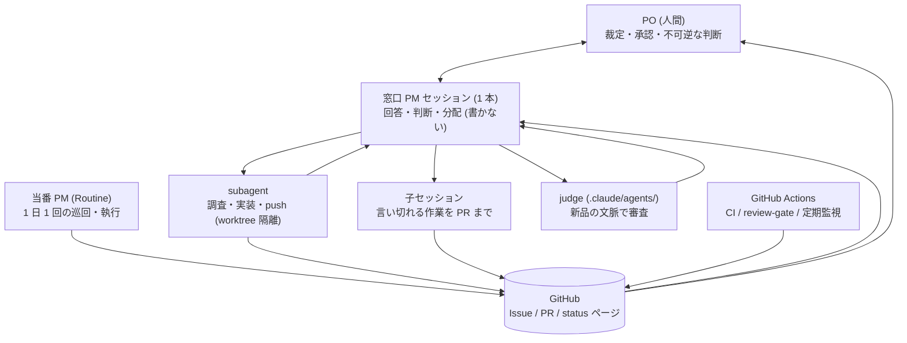

# このプロジェクトの体制 — 誰が何を担うか

Mind Inbox は **1 人の PO (人間) と、複数種類のエージェント / 機械**で回している。この 1 枚が「今、誰が何を担っていて、どこに痕跡が残るか」の入口。

- **判断の記録 (なぜ)** は [`docs/adr/`](adr/README.md)、**実行状態 (いつ・今どこ)** は GitHub Issues、**作業規約 (どう書くか)** は [`CLAUDE.md`](../CLAUDE.md)。このファイルは **役割 (誰が)** だけを持つ
- ここに書くのは**今の姿**。過去にどう変わってきたかは [`docs/adr/archive/operations/`](adr/archive/operations/) が持っている

## 全体図

矢印が示すとおり、**PO と直接話すのは窓口 PM だけ**で、それ以外の担い手の成果はすべて GitHub を経由して合流する。

## 1. PO (user)

- **担う** — 裁定と承認。design-gate での実装着手の承認 / ADR を `Proposed` → `Accepted` に動かすこと / 週次プロダクト目標の決定 / 優先順位リストの整理 / 「保留」の指示 / リリース PR の merge・deploy のボタン / `needs-human` の宿題 (web UI 設定・課金操作・外部サービス操作)
- **担わない** — 問題を巡回して見つけること。PO は**返信するだけで、見に行かない**。実装・レビュー・起票も担わない
- **どう聞かれるか** — 確認は散文に埋めず**選択肢形式** (クリック選択式) で出る。1 回の裁定は**最重要 3 件まで**で、「どのレーンが止まるか / 推奨 / 先送りの代償」がつく。残りは「寝かせ中 n 件」と件数だけ (全量はいつでも要求できる)
- **上がってくるのは 3 種類だけ** — 不可逆・高コスト / 北極星 / PO 名義が要るもの。それ以外は窓口 PM が決めて事後報告する (下の「[委任の境界](#委任の境界)」)
- **痕跡** — ADR の Status 行 / `needs-human` Issue の close / Issue・PR へのコメント / [`docs/debrief/journal.md`](debrief/journal.md)
- **PO が応答しない日は、ゲート対象だけが止まり、他は進む**のが仕様 (無応答は障害ではない)

## 2. 窓口 PM セッション

user の対話窓口。**常に 1 本**で、使い捨てローテーションする。**守る資源は窓口の可用性** — PO の時間が一番高いので、窓口は **PO の問いにいつでも答えられる状態**を保つ。

- **担う** — 3 つだけ: **user への回答** (答えるための調査を含む) / **判断** (どの案を採るか / マージしてよいか / 何が本丸か / design-gate の実施) / **分配** (起票パケットの作成と実行者の起動)。その現れとして、GitHub のライブ状態 (open PR / `needs-human` / Proposed ADR / 自動起票 Issue) の復元と「🙋 あなたの番」付きの報告 / PR の受け入れレビュー (`[pm-accept]` + 現 head SHA + 判定理由) / PR 追従とマージ / `stream:*` レーンの整備 / 旧窓口の退役
- **担わない** — **実装・修正・コミット・push** (**サイズを問わず** subagent か子セッションに出す。1 行でも出す。窓口が手を動かしている間 PO が待たされるので、判断軸は作業の大きさではなく「PO を待たせるか」) / **分配先の差分をまとめてコミットすること** (窓口が統合のボトルネックに戻る) / 技術レビュー (judge が担う) / リリース PR の merge・deploy / design-gate 対象の設計判断を子や subagent へ分配すること / 不可逆な判断を無人で進めること
- **手を動かしてよい例外は 2 つだけ** — user の質問に答えるための調査 (grep / read / 実行して確かめる。回答そのものだから) / 分配先が詰まって user に判断を返すための状況確認 (`get_session` / PR・Issue の確認)
- **名乗りと退役** — 自分に `[PM] Mind Inbox ハブ (YYYY-MM-DD〜)` を `set_session_title` で付け、旧窓口を `[PM-retired] <元タイトル>` にリネームして `archive_session` する。**これを行えるのは新しく開かれた対話セッションだけ** (当番 Routine・子・subagent は退役操作をしない)。実行中の窓口は退役させず、archive の前に in-flight を GitHub へ書き出す
- **モデルは Fable 5** (2026-08-14 PO 裁定) — 窓口が使うのは判断の質。物量は Opus 5 の分配先に出すことで、全部を Fable で回して上限を先に使い切るのを防ぐ
- **着工の排他** — **機構は無い** (claim ref は設計だけで未実装 — 下の「未定 / 未検証」)。**本数の上限も無い** — 並列化が既定 ([`dispatch` skill](../.claude/skills/dispatch/SKILL.md))。今あるのは起票パケットの**ファイル境界**と、着手前の open PR / ブランチ確認だけ
- **痕跡** — 対話そのもの / PR の `[pm-accept]` コメント / Issue / PM ハブ Issue の引き継ぎ宣言 / journal

### 委任の境界

**既定は「聞かずに決めて進め、事後に報告する」** (2026-08-15 PO 裁定)。PO の指示は「自律的にしてほしい。もちろん勝手にやるとめちゃめちゃまずいときは聞いてもらって全然いいんだけど、どんどんプロアクティブにやってほしい」。**確認を取ること自体がコスト** — 窓口が守る資源は PO の時間なので、「念のため聞く」は安全側ではなく、守るはずのものを削る側に倒れている。

| 区分                                     | 何が入るか                                                                                                                                                                                                                         | 出し方                                                                                                 |
| ---------------------------------------- | ---------------------------------------------------------------------------------------------------------------------------------------------------------------------------------------------------------------------------------- | ------------------------------------------------------------------------------------------------------ |
| **① 聞かずに決める (事後報告)**          | **可逆な運用判断すべて** — Issue の整理・クローズ (根拠つき) / 実装方式の選択 / 着手順・並行度 / レビュー指摘への裁定 / PR の受け入れ (merge gate の運用) / 規約文書の精緻化 / 承認済み設計の中の詳細判断                          | 決めて進める。**何を決めたか・なぜか**を Issue / PR に残す                                             |
| **② PO に上げる (対話はブロックしない)** | (1) **不可逆・高コスト** — リソース削除 / 課金が乗る変更 / 公開面が開く変更 / セキュリティ姿勢を緩める変更 (2) **北極星** — プロダクトが何であるかに触れる判断 (3) **形式上 PO 名義が要るもの** — ADR の Accept / ux-rubric の改定 | **溜めてまとめて出す** (デブリーフ・節目・「🙋 あなたの番」)。**案 + 推奨**まで作り、PO は Yes/No だけ |
| **③ 即時に聞く**                         | **取り返しがつかない事故になりうる**と PM が判断したとき                                                                                                                                                                           | その場で止めて聞く。**この判断自体は保守側に倒す**                                                     |

- **①の事後報告は巻き戻せる形で残す** — PO はいつでも覆せるのが前提なので、残すのは結論だけでなく**なぜそう決めたか**。根拠の無い決定は覆す判断ができず、事後報告の体をなさない
- **②を理由に PO を待たない** — 上げるのは「止める」ためではなく裁定を取るため。止まるのは②に依存する部分だけで、他は進む (§1 の「PO が応答しない日は、ゲート対象だけが止まり、他は進む」と同じ仕様)
- **②の出し方は「裁定 3 件」の枠と同じ** ([`streams.json`](../cicd/scripts/status-page/streams.json) の `decision_batch`)。①をここに積むと**裁定枠を食い潰し、本当に止まっているものが 4 件目に落ちて出なくなる** — 委任が広がるほど、この枠を②だけに保つ意味が強くなる
- **迷ったら①に倒し、迷ったことごと事後報告に書く** (「判断に迷ったが①として進めた」と書けば、PO は境界そのものを直せる)。ただし**「迷ったら①」が効くのは可逆だと確認できている判断のなかでの迷い**で、**可逆かどうか自体が判定できないときは③へ倒す** (判定できない = 取り返しがつかない可能性を否定できない、なので③の定義にそのまま入る)。**境界を動かせるのは PO 裁定だけ**
- **③の回数はデブリーフで見る** — 増えているなら境界がずれているか、②に落とせるものを③に上げている

### 当番 PM (Routine)

対話を持たない PM。claude.ai の Routine が**毎回新しいセッション**を起こし、**18:00 JST の 1 日 1 回**発火する。open PR の掃き出し・レビュー滞留の追従・`needs-human` の集計を回し、**異常ゼロでも必ず** Issue #254 に巡回レポート (冒頭「🙋 あなたの番」) を残す。当番がやらないこと: リリース PR の merge / deploy、`needs-human`・保留 PR への操作、design-gate 級の設計判断 (Issue に積んで窓口 PM へ回す)、窓口の退役。

## 3. 子セッション

`create_session` で起こす独立コンテナのセッション。**起票パケットを渡されて動く**。

- **担う** — 指示を一度で言い切れて、長時間かかり、成果が PR / Issue に残る作業。**コミットと push、PR 作成と CI 追従まで自分で完遂する** (親は統合しない)
- **担わない** — user への直接報告 / 短い往復を要する作業 / 窓口の退役操作
- **起こし方** — `source_url` と `source_revision` は**必須** (環境は継承されるがリポジトリは継承されない)。起票パケットは 7 点: 対象 Issue / 完遂条件 / **触ってはいけないファイル境界** / CLAUDE.md 参照 / **コミットと push まで完遂すること** / 詰まったら Issue にコメントして終了 / 報告先。使い終わったら `archive_session` する
- **モデルは Opus 5** (2026-08-14 PO 裁定) — `create_session` に `model: "claude-opus-5"` を明示する。**省略すると親 (Fable 5) を継承する**
- **会話は片道 約 1 分** — `send_message` / `list_events` はこの環境に無く、メッセージは `create_trigger` + `run_once_at` を相手セッションに bind して届ける。**往復が 1 回増えるごとに 1 分待つ**ので、短い往復を繰り返す作業は子に出さず subagent にする
- **止まったら** — `get_session` の `status_category` が `need_input` なら権限待ち。`needs_action` のツール名を `.claude/settings.json` の `allow` に足して**子を起こし直す** (起動済みの子には設定が効かない)。ただし `deny` のツールは足さず、commit + PR に切り替えさせる
- **痕跡** — PR / 対象 Issue へのコメント (子 → 親の報告は Issue コメントが既定)

## 4. subagent

`Agent` ツールで起こす、親と同じセッション内の別コンテキスト (`isolation: "worktree"` で作業ファイルを隔離する)。

- **担う** — **窓口が書かない実装のすべて** (サイズを問わない。1 行の修正・設定変更も含む) / 調査を伴う作業 / 途中で判断が要る作業 / 結果を読んで次を決める作業。**コミットと push まで担う**。judge もこの形で動く
- **担わない** — user との対話 / PR の受け入れ判定とマージ (判断は窓口) / 窓口の退役操作
- **モデルは Opus 5** (2026-08-14 PO 裁定) — `Agent` 呼び出しに `model: "opus"` を明示する。**省略すると親 (Fable 5) を継承する**。judge など判断の質そのものが成果物の呼び出しだけ、窓口が都度 Fable 5 に上げてよい
- **出す理由は独立性ではなく、窓口の可用性** — 窓口が手を動かしている間 PO が待たされる。実装者とレビュアーの分離はレビュー側の judge が担う
- **指示文は子と同じ起票パケット** (対象 Issue / 完遂条件 / ファイル境界 / CLAUDE.md 参照 / コミットと push まで完遂) を満たし、成果 PR の本文にも残す
- **同一セッション内の subagent どうしは `SendMessage` で直接やり取りできる** (親を経由しなくてよい) — ただし **subagent は `ListAgents` を持たないので相手を発見できず、親が相手の名前を渡さないと宛先を書けない**。**セッションを跨いだピアは依然として見えない** (`No reachable agents`) ので、跨ぎの連絡は Issue コメント / Routine のまま (2026-08-13 実測)
- **痕跡** — 自分で push したブランチ / PR (投稿が要る場合は親が代わりに残す)

## 5. judge (`.claude/agents/`)

審査役。**新品コンテキストの subagent** として起動し、**実装セッションの会話・前提を一切引き継がない**。これが judge の存在理由そのもの — 決めた本人の前提こそが盲点になるため。

| judge                | いつ起動                 | 担うもの                                            |
| -------------------- | ------------------------ | --------------------------------------------------- |
| `code-reviewer`      | コード PR                | diff の技術レビュー (`review-rubric.md` の C1〜C9)  |
| `security-reviewer`  | PR / release-gate        | スキャナ総動員 + 動的チェック + 攻撃面の追跡        |
| `qa-reviewer`        | release-gate / 大きめ PR | 受け入れマトリクスと異常系スモークの作成・実行      |
| `biz-owner-reviewer` | release-gate             | 初見ユーザーとして UI を実操作したウォークスルー    |
| `release-judge`      | リリース PR              | 4 レポート + CI の突合と Go/No-Go (既定は NO-GO)    |
| `ux-reviewer`        | UX プローブ記録の採点    | 相談会話 JSON の rubric 採点                        |
| `debt-reviewer`      | 定期の負債棚卸し         | 指定範囲の悉皆調査 (機械検出器が見つけられないもの) |

- **共通の規律** — 審査基準は `.github/claude/*-rubric.md` (+ 共通規約 `_common.md`) が正典 (rubric-as-truth)。**judge はコードを変更せず、投稿もしない** (投稿は呼び出し元の責務)。`qa-reviewer` だけがテストコードに限って書ける
- **機構で縛ってある** — judge に渡してあるのは**読み取り専用の GitHub MCP ツール**だけで、コメント投稿・resolve・merge・issue 更新は渡していない。`ToolSearch` も渡していない (後から書き込みツールを読み込めるため)。付与先は `code-reviewer` / `qa-reviewer` / `release-judge` の 3 体に限っている
- **痕跡** — PR コメント (代役レビューは `<!-- standin-review -->` + 現 head SHA 付き) / release-gate のレポート。**status ページには judge の行が無い** (下記)
- **今の状態: Codex は 2026-08-13 に PR [#388](https://github.com/yomote/mind-inbox/pull/388) で 2 回動いた** — 03:58 UTC に `.claude/skills/dispatch/SKILL.md` へ P2 指摘を投稿し ([discussion_r3772284108](https://github.com/yomote/mind-inbox/pull/388#discussion_r3772284108))、13:00 UTC に `6d618d8` を再レビューして `Didn't find any major issues` を投稿した ([issuecomment-5280750928](https://github.com/yomote/mind-inbox/pull/388#issuecomment-5280750928)。後者は 12:58 の `@codex review` コメントで明示的に起こしたもの)。よって「Codex が利用上限で停止しているので代役の `code-reviewer` が技術レビューを担う」([#345](https://github.com/yomote/mind-inbox/issues/345)) は、**少なくとも 2026-08-13 時点では成り立たない**。ただし確認できたのは**この日に 2 回投稿できたという事実だけ**で、利用上限が恒久的に解けたかは **未検証** (残量は GitHub から読めない) — 下の「未定 / 未検証」を見ること
- **代役 `code-reviewer` に回すときの前提は変わらない** — **代役は Claude なので独立性は回復しない**。実装もレビューも同じ系統のモデルで、同じ盲点を共有する (モデル名を分けても系統は同じ)。代役は Codex が沈黙している間だけ目隠しを薄くする措置であって、代替ではない
- **今の状態: 代役 judge を自動起動する経路がまだ無い。** PR レビュー Routine は web UI での登録が必要で、未登録のまま。**status ページにこの行は無い** — [`watchers.json`](../cicd/scripts/status-page/watchers.json) の `routines` にあるのは「当番 PM tick」1 行だけで、PR レビュー Routine の行は退役時 ([PR #385](https://github.com/yomote/mind-inbox/pull/385)) に削除済み (2026-08-21 実測)。**つまり「呼ばれていない」を赤で教えてくれる場所はどこにも無い** — judge は PM が手で呼ぶしかなく、**呼び忘れれば何の印も出ずに沈黙する**。行を戻すなら Routine の登録が先 (登録の無い行は恒常 🔴 になり、赤が常態化して読まれなくなる)

## 6. GitHub Actions

**規律ではなく機構で守る層**。セッションの生死に依存せず、run 履歴が必ず残る。

- **PR ごとの門** — `test` (4 層テスト + lint/build) / `CodeQL` (**GitHub の default setup**。自前 workflow だった `codeql.yml` は 2026-08-14 の PO 裁定で退役 — [#408](https://github.com/yomote/mind-inbox/issues/408)) / `iac-validate` / `adr-number-guard` (ADR 採番の衝突) / `auto-improve-guard` (自動改変の範囲)
- **マージの門** — `review-gate` が commit status を貼る。緑になる条件は 3 つ: (1) `[pm-accept]` + 現 head SHA の受け入れコメント、(2) レビュースレッドが全解決、(3) コード PR なら**独立レビューが 1 本** (担い手は Codex でも代役 judge でもよい)。**push で受け入れは失効する**。実装差分が不変の main 追随だけは引き継がれる建前だが、**成立を当てにしない** ([#323](https://github.com/yomote/mind-inbox/issues/323) が open — 指紋が patch 本文まで畳むため、base が進んだだけの追随でも失効することがある / 2026-08-12 実測)。さらに 30 分毎の sweep が advisory・マージ執行・ストール検知を回す
- **配る** — `deploy` (main → dev) / `build-images` (ghcr へ事前ビルド)
- **見張る** — `golden-path-monitor` (毎朝の実環境チェック) / `ux-eval` (UX 機械計測) / `debt-check` / `security-sweep` / `refresh-infra-diagram` / `status-page`
- **手で叩く** — `ops-inspect` (外の事実を read-only で取る) / `github-settings` (宣言 → 現実の点検・適用) / `ux-data-migrate`
- **見張り役を置かない** — 落ちた workflow **自身**が Issue を立てる (`.github/actions/report-failure`)。見張りが黙る問題が原理的に消える (黙っている = 落ちていない)
- **担わない** — 「やってほしいことがそこにあるか」の判定 (意図を知る PM の仕事) / リリースの merge・deploy の最終ボタン (人間)
- **痕跡** — run 履歴 + [status ページ](https://yomote.github.io/mind-inbox/status/)。**何を見張るかの唯一の真実は [`cicd/scripts/status-page/watchers.json`](../cicd/scripts/status-page/watchers.json)** — 自動化を足したらここに 1 行足す。足せないなら作らない (唯一の例外は [`cicd/scripts/claude-hooks/`](../cicd/scripts/claude-hooks/) — 正典は root [`CLAUDE.md`](../CLAUDE.md) の例外宣言。生死は CI の配線テストが見る)

## 規律は破られ、機構は守られる

このリポジトリは一貫して「気をつける」で守ろうとしたものが破られ、**機械が判定するものだけが守られてきた**。だから守りたい不変条件は、文章ではなく **check の色 / ref / ラベル / 権限設定**に落とす。

- マージ可否は明文の解釈ではなく **`review-gate` の色**で読む。受け入れは head SHA を含む規約により **push で機械的に失効する**
- main のブランチ保護は **Bypass list を空**にする — エージェントも PO と同じアカウント (admin) で操作するため、admin バイパスを残すと門が門でなくなる。緊急時の脱出口は ruleset の一時 Disable
- PR を経ずリポジトリを直接書き換える MCP ツール (`delete_file` / `push_files` / `create_or_update_file`) は `deny` に置く。**`ask` は使わない** — 人が張り付いていないセッション (当番 Routine / 子) では `ask` は永久に止まり、沈黙と正常の区別が壊れる
- 並行作業の衝突は起票パケットの**ファイル境界**で防ぐ。**二重着工の排他だけはまだ機構が無い** (claim ref は未実装 — 下の「未定 / 未検証」) ので、ここは規律で持っている = 破られる前提で見ておく
- **腐敗は隠さず膨らませる** — `stream:*` の無い Issue は「未分類 n 件」として必ず数え、Routine の痕跡が欠けたら status ページが赤くなる。静かに腐る仕組みは作らない

## 役割はセッションの起こされ方で決まる

役割は **どう起こされたか**で決まる。名乗りでもモデルでもない (モデルは役割に付いてくる — 各節の「モデルは〜」を見ること)。

| 起こされ方                                                           | 役割                                          |
| -------------------------------------------------------------------- | --------------------------------------------- |
| 起票パケット (対象 Issue / 完遂条件 / ファイル境界) を渡されて起きた | **子セッション**                              |
| 何も渡されていない対話セッション (最初のメッセージが挨拶だけでも)    | **窓口 PM**                                   |
| `Agent` ツールで呼ばれた                                             | **subagent** (judge 名で呼ばれたら **judge**) |
| Routine のプロンプトで発火した                                       | **当番 PM**                                   |

窓口 PM は用件に入る前に、GitHub のライブ状態を復元して「🙋 あなたの番」付きの報告を出すところから始める。**起動プロンプトのコピペは不要** — 名乗りと旧窓口の退役は窓口自身が機械で行う。手順は [`dispatch` skill](../.claude/skills/dispatch/SKILL.md)。

## 痕跡はどこに残るか

| 場所                                                             | 何が残るか                                                                                                                |
| ---------------------------------------------------------------- | ------------------------------------------------------------------------------------------------------------------------- |
| **PR**                                                           | 1 つの解の単位。実装 / 受け入れ (`[pm-accept]`) / レビュー指摘 / judge のレポート                                         |
| **Issue**                                                        | 解きたい問題と実行状態。`stream:*` の 5 レーンが地図、`needs-human` が人間の宿題キュー、当番の巡回レポート、子 → 親の報告 |
| **[status ページ](https://yomote.github.io/mind-inbox/status/)** | 自動化の生死 (watchers.json の定義から毎回生成)。手書きの台帳は作らない                                                   |
| **[journal](debrief/journal.md)**                                | セッション記録・design-gate / debrief の記録                                                                              |
| **データブランチ** (`data/ux-observations`)                      | UX プローブ記録と採点 (JSONL)                                                                                             |

**取れなかったものを「異常なし」と書かない** — 取得・検証に失敗したら、成功と区別できる形で出す (`未検証: 理由` / status を error にする / run を落とす)。これはこのリポジトリで最も繰り返している事故。

## 未定 / 未検証 (推測で埋めないこと)

- **claim ref による着工排他 (`refs/heads/claim/<Issue 番号>`)** — **設計だけで、実装も運用も無い** (2026-08-13 実測: `git ls-remote origin 'refs/heads/claim/*'` は 0 件 / origin の 138 本にも無く、`cicd/` `.github/` `.claude/` に claim ref を触るコードも 0 件)。採るなら**排他 (取得) だけを書かない** — **解放** (PR の merge / close で ref を削除。取りこぼしは当番が掃除) と**失効** (claim から一定時間経ち対応する PR も動いていない claim は死んだとみなし、`--force-with-lease` で観測した旧 SHA を expect に置いて奪う) を同時に持たせること。取得だけだと、**着工セッションがクラッシュ・退役した瞬間にその Issue が恒久的に着工不能になる** — 使い捨てローテーション前提のこの体制では、それは異常系ではなく通常運転
- **子 → 親の Routine 経路** — 実測できているのは親 → 子の向きだけ。逆向きは未検証なので、子 → 親の報告は Issue コメントを既定にする
- **`fire_trigger` による即時 poke が配送されない理由** — 未特定 ([#353](https://github.com/yomote/mind-inbox/issues/353))
- **judge の frontmatter `tools:` が MCP ツール名を受け付けるか** — 未検証。次に judge を回したとき、GitHub の読み取りが実際に通ったかを確認する
- **`REVIEW_GATE_REQUIRE_CODEX` の現在値** — 2026-08-12 時点の実測では `false` で、独立レビュー必須の条件が効いていない。`true` に戻すのは PO の web UI 操作。以後変わったかはリポジトリから読めない (**未確認**)
- **Codex が継続して動くか (恒久復帰か)** — **未検証**。2026-08-13 に PR [#388](https://github.com/yomote/mind-inbox/pull/388) で 2 回投稿したのは実測 (5 章) だが、これは「その日は叩けた」という 1 日分の観測でしかなく、利用上限が恒久的に解けた証拠ではない。**「復帰した」と断定しない** — 判断材料は次の数本のコード PR で Codex が実際に指摘を出しているか。恒久的に動くと確認できたときに初めて、指摘者を Codex に戻し、代役 Routine を退役させて watchers.json から 1 行消す
- **merge queue** — workflow 側は `merge_group` を報告する形になっているが、**queue の有効化自体は未完了** ([#269](https://github.com/yomote/mind-inbox/issues/269) の `needs-human`)
